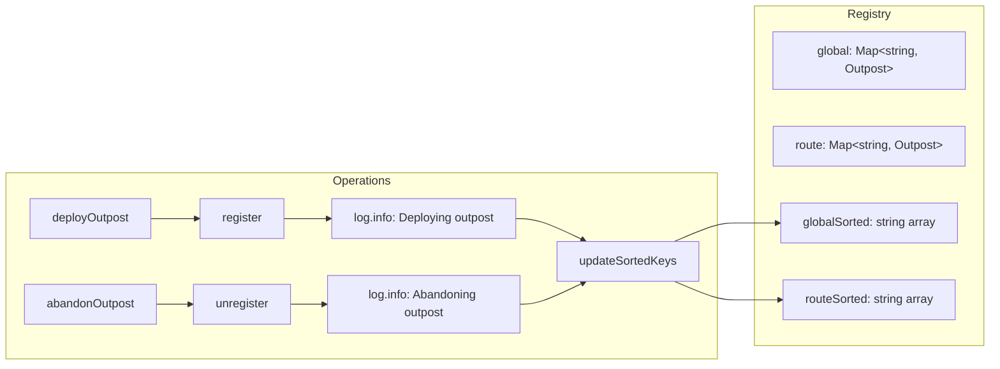
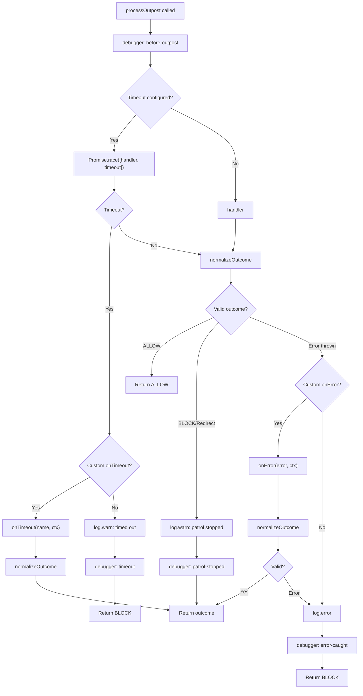

# ⚙️ Architecture

Deep dive into how vue-router-citadel works internally.

## 🗄️ Registry Structure

The citadel maintains a registry with separate maps for global and route outposts. Sorted arrays are
pre-computed on every `deployOutpost` / `abandonOutpost` for efficient navigation processing.

**Optimization:** Sorting happens at deploy/abandon time, not during navigation. This ensures
navigation remains fast regardless of the number of outposts.

## 🔄 Outpost Processing

How a single outpost is processed during patrol:

## 🔄 Complete Navigation Example

Full sequence diagram showing a navigation with global and route outposts:

```mermaid
sequenceDiagram
    participant U as User
    participant R as Router
    participant C as Citadel
    participant Reg as Registry

    U->>R: Navigate to /admin/users

    Note over R,C: beforeEach hook
    R->>C: patrol(registry, ctx, options)

    C->>C: Collect route names from matched stack
    C->>C: Deduplicate
    C->>C: Count outposts for hook

    Note over C: log.info: beforeEach /home -> /admin/users (N outposts)
    Note over C: debugger: navigation-start

    loop Global Outposts
        Note over C: log.info: Processing outpost "name"
        Note over C: debugger: before-outpost
        C->>Reg: Get deployed outpost
        Reg-->>C: outpost
        C->>C: processOutpost → ALLOW
    end

    loop Route Outposts
        Note over C: log.info: Processing outpost "name"
        Note over C: debugger: before-outpost
        C->>Reg: Get assigned outpost
        Reg-->>C: outpost
        C->>C: processOutpost → ALLOW
    end

    C-->>R: ALLOW → true

    Note over R,C: beforeResolve hook (no outposts)
    R->>C: patrol(registry, ctx, options)
    Note over C: No outposts for hook → skip silently
    C-->>R: ALLOW → true

    R->>R: Load component

    Note over R,C: afterEach hook
    R->>C: patrol(registry, ctx, options)
    Note over C: No return value used

    R-->>U: Page rendered
```

