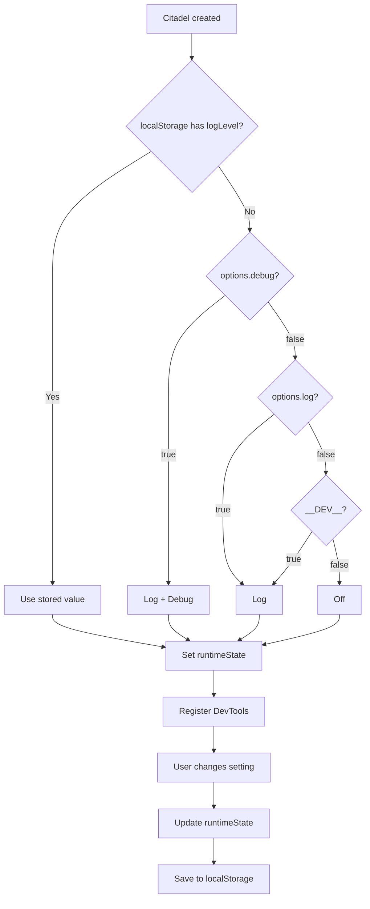

# 🛠️ DevTools Internals

Deep dive into how the DevTools settings panel resolves and persists logging configuration.

For basic setup and inspector features, see [Vue DevTools](/guide/devtools).

## ⚙️ Settings Priority

Settings are resolved in this order (first available wins):

```
localStorage → citadel options → defaults (__DEV__)
```

1. **localStorage** — if user changed settings via DevTools, persisted value is used
2. **citadel options** — `log` and `debug` options passed to `createNavigationCitadel`
3. **defaults** — `log: __DEV__`, `debug: false`

## 💾 localStorage Persistence

Settings are stored in localStorage with the key:

```
vue-router-citadel:settings:logLevel
```

Values: `off`, `log`, `debug`

## 📊 Settings Resolution Flow



<!--@include: ../_snippets/legend.md-->
