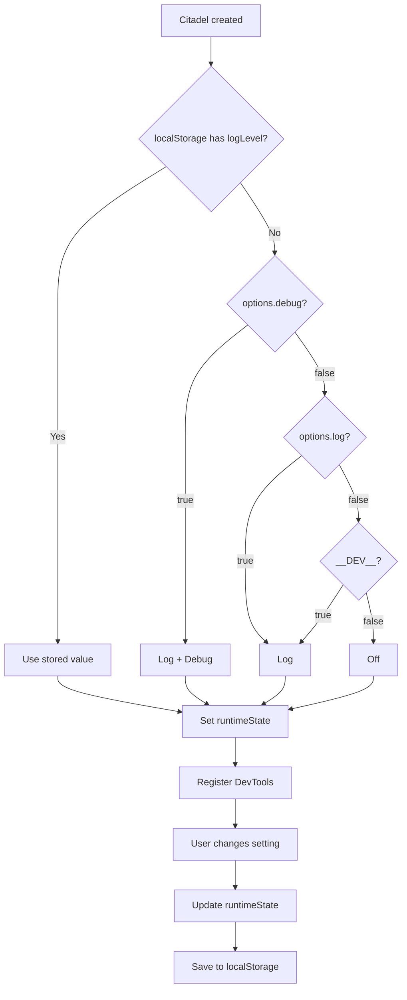

# 🛠️ Vue DevTools

Custom inspector for viewing deployed outposts. Enabled automatically in development.

## ⚡ Enabling DevTools

```typescript
const citadel = createNavigationCitadel(router);
app.use(citadel); // DevTools enabled automatically (default: __DEV__)
```

**Disable DevTools:**

```typescript
const citadel = createNavigationCitadel(router, { devtools: false });
```

::: info When `devtools: false`, devtools code is tree-shaken from the bundle via dynamic import.
:::

| Option     | Type      | Default   | Description                          |
| ---------- | --------- | --------- | ------------------------------------ |
| `devtools` | `boolean` | `__DEV__` | Enable Vue DevTools custom inspector |

## 🔍 Inspector Features

The custom inspector provides:

- **Tree view** — Global and Route outpost groups with expandable nodes
- **Tags** — Each outpost shows priority badge and hooks count
- **State panel** — Detailed view with name, scope, priority, hooks array, timeout value
- **Auto-refresh** — Inspector updates automatically on deploy/abandon operations

## ⚙️ Settings Panel

The DevTools settings panel allows runtime control of logging and debug modes. See [Logging & Debug](/advanced/logging) for all log events, custom logger, and debug breakpoints reference.

### Log Level Selector

A button-group selector with three options:

| Option          | `log`   | `debug` | Description                  |
| --------------- | ------- | ------- | ---------------------------- |
| **Off**         | `false` | `false` | No logging                   |
| **Log**         | `true`  | `false` | Non-critical logging enabled |
| **Log + Debug** | `true`  | `true`  | Logging + debug breakpoints  |

### Settings Priority

Settings are resolved in this order (first available wins):

```
localStorage → citadel options → defaults (__DEV__)
```

1. **localStorage** — if user changed settings via DevTools, persisted value is used
2. **citadel options** — `log` and `debug` options passed to `createNavigationCitadel`
3. **defaults** — `log: __DEV__`, `debug: false`

### localStorage Persistence

Settings are stored in localStorage with the key:

```
vue-router-citadel:settings:logLevel
```

Values: `off`, `log`, `debug`



<!--@include: ../_snippets/legend.md-->
