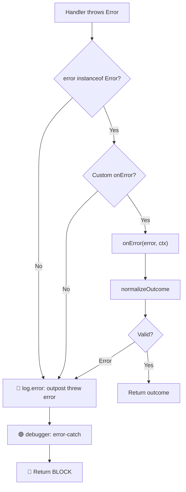
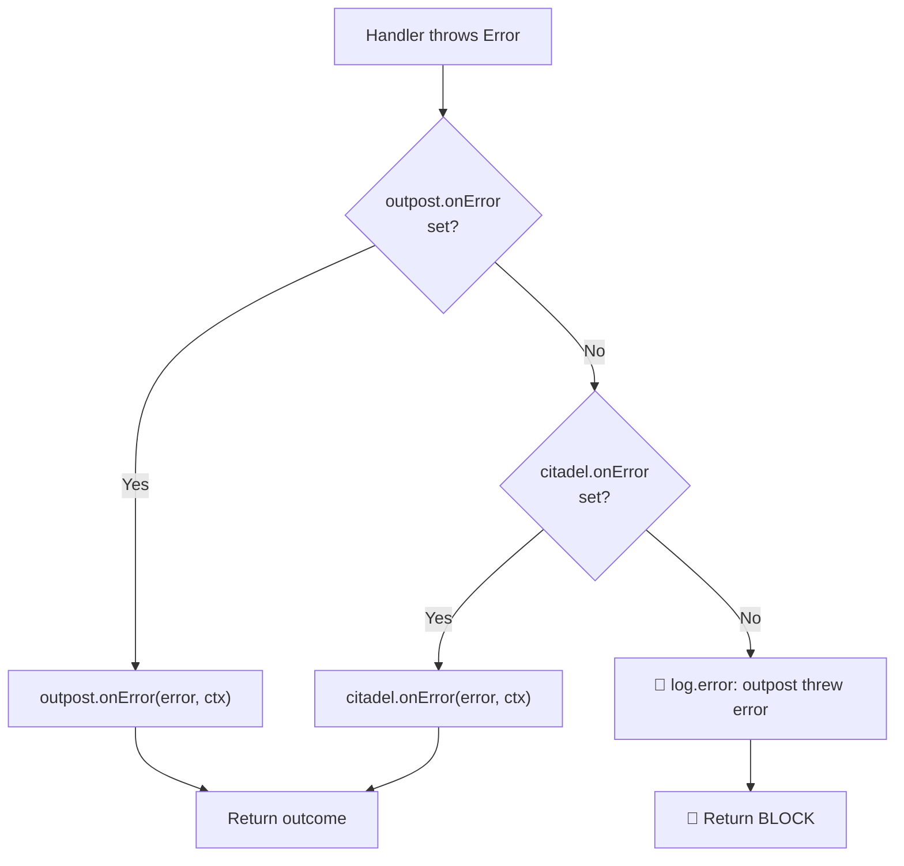

# 🚨 Error Handling

How Vue Router Citadel handles errors thrown by outpost handlers, timeouts, and afterEach failures.

## 📊 Error Flow


```mermaid
flowchart TD
    A[Handler throws Error] --> B{error instanceof Error?}

    B -->|Yes| C{Custom onError?}
    B -->|No| LOG1[🔴 log.error: outpost threw error]

    C -->|Yes| E["onError(error, ctx)"]
    C -->|No| LOG1

    E --> F[normalizeOutcome]
    F --> G{Valid?}
    G -->|Yes| H[Return outcome]
    G -->|Error| LOG1

    LOG1 --> DBG1[🟣 debugger: error-catch]
    DBG1 --> I[🔴 Return BLOCK]
```

## ⚙️ Default Behavior

When no `onError` handler is provided:

1. Error is logged via `logger.error` (always — critical event)
2. Debug breakpoint `error-catch` triggers (if `debug: true`)
3. Navigation is **blocked** (`BLOCK`)

```typescript
const citadel = createNavigationCitadel(router);

citadel.deployOutpost({
  name: 'broken',
  handler: () => {
    throw new Error('Something went wrong');
  },
});

// Navigation to any route → BLOCK
// Console: 🔴 [🏰 NavigationCitadel] Outpost "broken" threw error: Something went wrong
```

## 🔧 Custom Error Handler (`onError`)

Redirect users to an error page instead of blocking:

```typescript
const citadel = createNavigationCitadel(router, {
  onError: (error, ctx) => {
    console.error('Navigation error:', error);
    return { name: 'error', query: { message: error.message } };
  },
});
```

The `onError` handler receives:

- `error` — the thrown `Error` instance
- `ctx` — the same [handler context](/guide/hooks#handler-context) (`verdicts`, `to`, `from`, `router`, `hook`)

`onError` can return any [verdict](/guide/verdicts#return-values): `ALLOW`, `BLOCK`, or redirect.

::: warning
If `onError` itself throws an error, the citadel falls back to the default behavior — log and `BLOCK`.
:::

## 🎯 Per-Outpost `onError`

Override the citadel-level handler for a single outpost — useful when error policies differ between outposts (e.g. report `auth` failures to Sentry but silently allow `preload` errors).

```typescript
const citadel = createNavigationCitadel(router, {
  onError: (_, ctx) => ({ name: 'error' }),
});

citadel.deployOutpost({
  name: 'auth',
  handler: authCheck,
  onError: (error, ctx) => {
    sentry.captureException(error);
    return { name: 'login' };
  },
});

citadel.deployOutpost({
  name: 'preload',
  handler: preloadData,
  onError: (_, ctx) => ctx.verdicts.ALLOW,
});
```

Resolution order:


```mermaid
flowchart TD
    A[Handler throws Error] --> B{outpost.onError<br/>set?}
    B -->|Yes| C["outpost.onError(error, ctx)"]
    B -->|No| D{citadel.onError<br/>set?}
    D -->|Yes| E["citadel.onError(error, ctx)"]
    D -->|No| LOG[🔴 log.error: outpost threw error]
    LOG --> F[🔴 Return BLOCK]
    C --> G[Return outcome]
    E --> G
```

## ⏱️ Timeout Errors

Timeouts follow a similar flow — if `onTimeout` is provided, it controls the outcome; otherwise navigation is blocked with a warning.

See [Outpost Timeout](/guide/timeout) for configuration, priority resolution, and examples.

## 🪝 afterEach Errors

Errors in `afterEach` outposts are handled differently:

- `afterEach` hooks **cannot block** navigation (Vue Router limitation)
- Errors are **always logged** via `logger.error` (critical event)
- Navigation proceeds regardless — the page is already rendered

```typescript
citadel.deployOutpost({
  name: 'analytics',
  hooks: [NavigationHooks.AFTER_EACH],
  handler: () => {
    throw new Error('Analytics failed');
    // Error logged, but navigation is NOT affected
  },
});
```

<!--@include: ../_snippets/legend.md-->
