# 🚨 Error Handling

How vue-router-citadel handles errors thrown by outpost handlers, timeouts, and afterEach failures.

## 📊 Error Flow

```mermaid
flowchart TD
    A[Handler throws Error] --> B{error instanceof Error?}

    B -->|Yes| C{Custom onError?}
    B -->|No| LOG1[🔴 log.error: outpost threw error]

    C -->|Yes| E["onError(error, ctx)"]
    C -->|No| LOG1

    E --> F[normalizeOutcome]
    F --> G{Valid?}
    G -->|Yes| H[Return outcome]
    G -->|Error| LOG1

    LOG1 --> DBG1[🟣 debugger: error-caught]
    DBG1 --> I[🔴 Return BLOCK]
```



## ⚙️ Default Behavior

When no `onError` handler is provided:

1. Error is logged via `logger.error` (always — critical event)
2. Debug breakpoint `error-caught` triggers (if `debug: true`)
3. Navigation is **blocked** (`BLOCK`)

```typescript
const citadel = createNavigationCitadel(router);

citadel.deployOutpost({
  name: 'broken',
  handler: () => {
    throw new Error('Something went wrong');
  },
});

// Navigation to any route → BLOCK
// Console: 🔴 [🏰 NavigationCitadel] Outpost "broken" threw error: Something went wrong
```

## 🔧 Custom Error Handler (`onError`)

Redirect users to an error page instead of blocking:

```typescript
const citadel = createNavigationCitadel(router, {
  onError: (error, ctx) => {
    console.error('Navigation error:', error);
    return { name: 'error', query: { message: error.message } };
  },
});
```

The `onError` handler receives:

- `error` — the thrown `Error` instance
- `ctx` — the same [handler context](/guide/verdicts#handler-context) (`verdicts`, `to`, `from`, `router`, `hook`)

`onError` can return any [verdict](/guide/verdicts#return-values): `ALLOW`, `BLOCK`, or redirect.

::: warning
If `onError` itself throws an error, the citadel falls back to the default behavior — log and `BLOCK`.
:::

## ⏱️ Timeout Errors

When an outpost exceeds its timeout, the flow is similar but uses `onTimeout`:

```mermaid
flowchart TD
    A[Handler exceeds timeout] --> B{Custom onTimeout?}

    B -->|Yes| C["onTimeout(outpostName, ctx)"]
    B -->|No| LOG1[🟡 log.warn: outpost timed out]

    C --> D[normalizeOutcome]
    D --> E{Valid?}
    E -->|Yes| F[Return outcome]
    E -->|Error| LOG1

    LOG1 --> DBG1[🟣 debugger: timeout]
    DBG1 --> G[🔴 Return BLOCK]
```



```typescript
const citadel = createNavigationCitadel(router, {
  defaultTimeout: 5000,
  onTimeout: (outpostName, ctx) => {
    console.warn(`${outpostName} timed out`);
    return { name: 'error', query: { reason: 'timeout' } };
  },
});
```

See [Outpost Timeout](/guide/timeout) for configuration details.

## 🪝 afterEach Errors

Errors in `afterEach` outposts are handled differently:

- `afterEach` hooks **cannot block** navigation (Vue Router limitation)
- Errors are **always logged** via `logger.error` (critical event)
- Navigation proceeds regardless — the page is already rendered

```typescript
citadel.deployOutpost({
  name: 'analytics',
  hooks: [NavigationHooks.AFTER_EACH],
  handler: () => {
    throw new Error('Analytics failed');
    // Error logged, but navigation is NOT affected
  },
});
```

<!--@include: ../_snippets/legend.md-->
