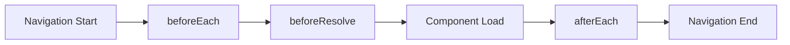
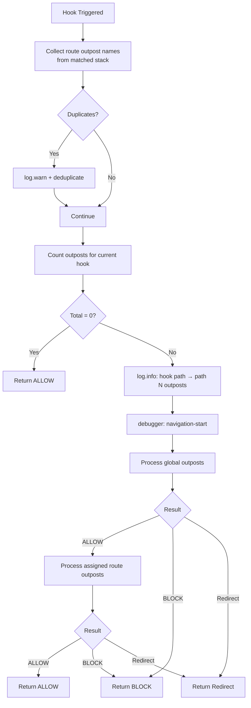

# 🪝 Navigation Hooks

Citadel integrates with Vue Router's navigation lifecycle through three hooks. Each hook triggers
the patrol system that processes all registered outposts.

## 📋 Hook Types

| Hook             | When                            | Can Block | Use Case                         |
| ---------------- | ------------------------------- | --------- | -------------------------------- |
| `BEFORE_EACH`    | Before navigation starts        | Yes       | Auth, permissions, redirects     |
| `BEFORE_RESOLVE` | After async components resolved | Yes       | Data validation, final checks    |
| `AFTER_EACH`     | After navigation completed      | No        | Analytics, logging, side effects |

::: tip For best understanding, read Vue Router's
[Navigation Guards](https://router.vuejs.org/guide/advanced/navigation-guards.html) and
[The Full Navigation Resolution Flow](https://router.vuejs.org/guide/advanced/navigation-guards.html#The-Full-Navigation-Resolution-Flow).
:::

## 🔄 Navigation Flow Overview



Each hook triggers `patrol` which processes all applicable outposts in priority order.

## 📊 Navigation Hook Flow

What happens when a navigation hook is triggered:



::: info Logging and debug breakpoints only trigger when there are outposts to process for the
current hook. If no outposts are registered for a hook, it returns `ALLOW` silently. :::

## ⚙️ Specifying Hooks

By default, outposts use `beforeEach`. Override with the `hooks` option:

```typescript
import { NavigationHooks } from 'vue-router-citadel';

citadel.deployOutpost({
  name: 'analytics',
  hooks: [NavigationHooks.AFTER_EACH],
  handler: ({ verdicts, to }) => {
    trackPageView(to.path);
    return verdicts.ALLOW;
  },
});
```

An outpost can handle multiple hooks:

```typescript
citadel.deployOutpost({
  name: 'admin-only',
  hooks: [NavigationHooks.BEFORE_RESOLVE, NavigationHooks.AFTER_EACH],
  handler: ({ verdicts, hook }) => {
    if (hook === 'beforeResolve') {
      // Check admin role
    }
    if (hook === 'afterEach') {
      // Log admin page view
    }
    return verdicts.ALLOW;
  },
});
```
