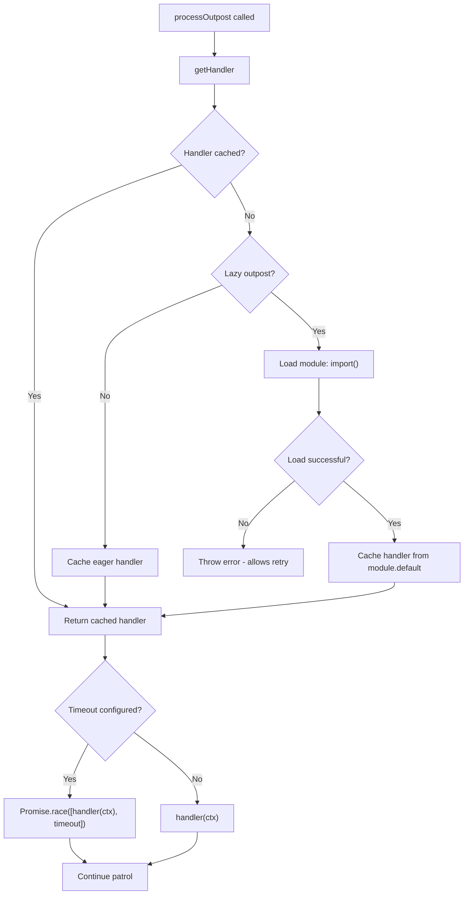

# 🦥 Lazy Outposts

Load heavy outpost handlers on-demand for better code splitting.

## ⚡ Basic Usage

```typescript
// Eager — loaded immediately (default)
import { authCheck } from './outposts/auth';

citadel.deployOutpost({ name: 'auth', handler: authCheck });

// Lazy — loaded on first navigation
citadel.deployOutpost({
  name: 'heavy-validation',
  lazy: true,
  handler: () => import('./outposts/heavy-validation'),
});
```

## 🔧 How It Works



## 🔑 Key Behavior

- Module loading has **no timeout** — network latency is unpredictable
- `timeout` applies **only to handler execution** after loading
- If load fails, error is passed to `onError` and **retry is allowed** on next navigation
- After first successful load, handler is **cached** — subsequent calls are instant

## 💡 Example: Lazy Outpost with Heavy Dependencies

```typescript
// src/outposts/premium.ts — loaded only when needed
import { z } from 'zod'; // Heavy dependency
import type { NavigationOutpostHandler } from 'vue-router-citadel';

const handler: NavigationOutpostHandler = ({ verdicts, to }) => {
  const schema = z.object({ tier: z.enum(['free', 'premium']) });
  const result = schema.safeParse(to.meta);

  if (!result.success || result.data.tier !== 'premium') {
    return { name: 'upgrade' };
  }

  return verdicts.ALLOW;
};

export default handler;
```

```typescript
// main.ts — premium outpost is lazy-loaded
citadel.deployOutpost({
  name: 'premium-check',
  lazy: true,
  timeout: 500, // 500ms for handler execution (loading not counted)
  handler: () => import('./outposts/premium'),
});
```

## 📊 Timeline Example

| Event                | Time  | Notes                   |
| -------------------- | ----- | ----------------------- |
| Navigation starts    | 0ms   |                         |
| Module load starts   | 0ms   | No timeout              |
| Module loaded        | 800ms | Slow network, but OK    |
| Handler starts       | 800ms | Timeout starts (500ms)  |
| Handler completes    | 900ms | 100ms execution < 500ms |
| Navigation completes | 900ms | Success                 |

If handler took 600ms (> 500ms timeout), it would timeout — but loading time is never counted.

<!--@include: ../_snippets/legend.md-->
