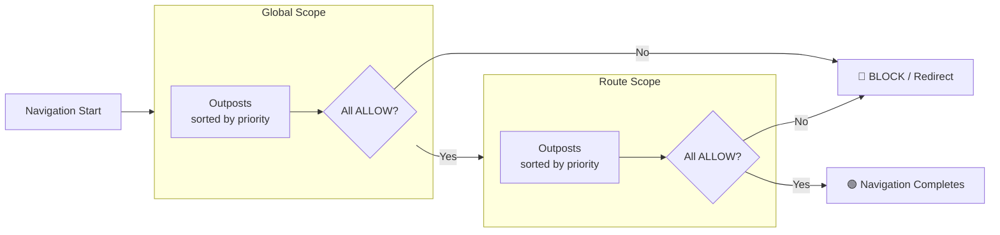
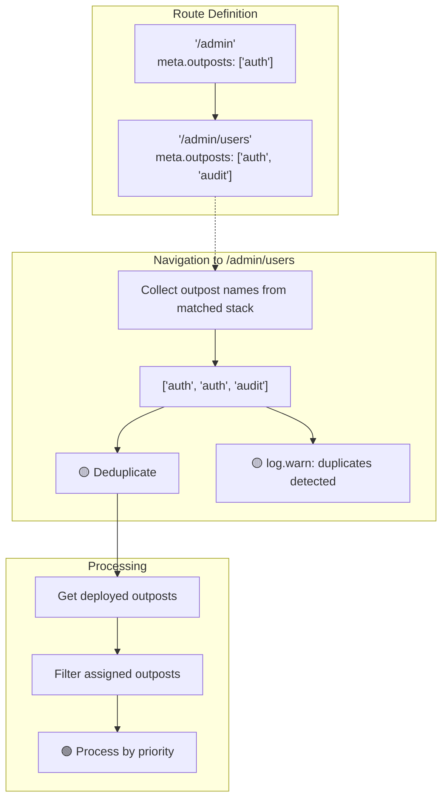

# ⭕ Outpost Scopes

Outposts are organized into two scopes that determine when they are processed during navigation.

## 🌐 Scope Types

| Scope    | Processing                  | Priority Sorting | Use Case                     |
| -------- | --------------------------- | ---------------- | ---------------------------- |
| `GLOBAL` | Every navigation            | Yes              | Auth, maintenance, analytics |
| `ROUTE`  | Only when assigned to route | Yes              | Route-specific permissions   |

## 🔢 Priority

Outposts within each scope are sorted by priority. Lower number = earlier execution.

```typescript
citadel.deployOutpost([
  { name: 'analytics', handler: analyticsHandler, priority: 200 }, // runs third
  { name: 'auth', handler: authHandler, priority: 10 }, // runs first
  { name: 'permissions', handler: permHandler, priority: 50 }, // runs second
]);
```

The default priority is `100` (configurable via `defaultPriority` option). Sorting happens at
deploy time, not during navigation — so there is no runtime overhead.

## 📊 Processing Order

**Processing order:**

1. Global outposts (sorted by priority, lower = first)
2. Route outposts (sorted by priority, filtered by `meta.outposts`)



## 🗺️ Route Outposts

Route outposts only run when referenced in a route's `meta.outposts` array:

```typescript
// Static assignment in route definition
const routes = [
  {
    path: '/admin',
    component: AdminPage,
    meta: { outposts: ['admin-only'] },
  },
];
```

```typescript
// Dynamic assignment via API
citadel.assignOutpostToRoute('admin', ['admin-only', 'audit']);

// Dynamic removal via API
citadel.revokeOutpostFromRoute('admin', 'audit');
```

## 🔄 Nested Routes & Deduplication

When navigating to nested routes, outposts from all matched routes in the hierarchy are collected.
Duplicates are automatically removed with a warning.



**Best practice:** Avoid duplicating outpost names in nested routes. Place shared outposts only on
the parent route.

<!--@include: ../_snippets/legend.md-->
