# ⭕ Outpost Scopes

Outposts are organized into two scopes that determine when they are processed during navigation.

## 🌐 Scope Types

| Scope    | Processing                  | Priority Sorting | Use Case                     |
| -------- | --------------------------- | ---------------- | ---------------------------- |
| `GLOBAL` | Every navigation            | Yes              | Auth, maintenance, analytics |
| `ROUTE`  | Only when assigned to route | Yes              | Route-specific permissions   |

**Processing order:**

1. Global outposts (sorted by priority, lower = first)
2. Route outposts (sorted by priority, filtered by `meta.outposts`)

## 📊 Scope Types Diagram

```mermaid
flowchart LR
    A[Navigation Start] --> B[Global Outposts<br/>sorted by priority]
    B --> C{All ALLOW?}
    C -->|Yes| D[Route Outposts<br/>from meta.outposts]
    C -->|No| E[🔴 BLOCK / Redirect]
    D --> F{All ALLOW?}
    F -->|Yes| G[🟢 Navigation Completes]
    F -->|No| E
```



## 🗺️ Route Outposts

Route outposts only run when referenced in a route's `meta.outposts` array:

```typescript
// Static assignment in route definition
const routes = [
  {
    path: '/admin',
    component: AdminPage,
    meta: { outposts: ['admin-only'] },
  },
];
```

```typescript
// Dynamic assignment via API
citadel.assignOutpostToRoute('admin', ['admin-only', 'audit']);
```

## 🔄 Nested Routes & Deduplication

When navigating to nested routes, outposts from all matched routes in the hierarchy are collected.
Duplicates are automatically removed with a warning.

```mermaid
flowchart TD
    subgraph Routes["Route Definition"]
        A["'/admin'<br/>meta.outposts: ['auth']"]
        B["'/admin/users'<br/>meta.outposts: ['auth', 'audit']"]
        A --> B
    end

    subgraph Collection["Navigation to /admin/users"]
        C["Collect outpost names from matched stack"]
        D["['auth', 'auth', 'audit']"]
        E["🟡 Deduplicate"]
        F["🟡 log.warn: duplicates detected"]
    end

    subgraph Execution["Processing"]
        G["Get deployed outposts"]
        H["Filter assigned outposts"]
        I["🟢 Process by priority"]
    end

    B -.-> C
    C --> D
    D --> E
    D --> F
    E --> G
    G --> H
    H --> I
```



**Best practice:** Avoid duplicating outpost names in nested routes. Place shared outposts only on
the parent route.

<!--@include: ../_snippets/legend.md-->
