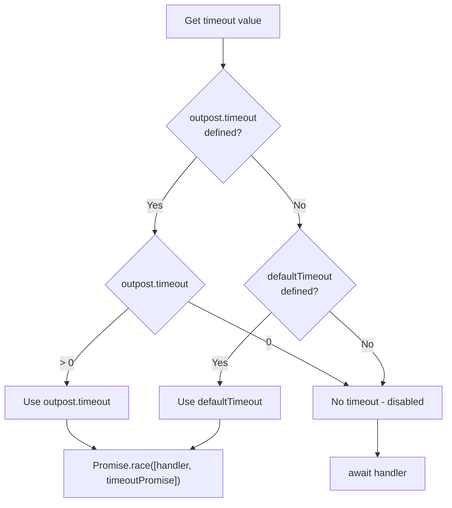

# ⏱️ Outpost Timeout

Prevent outposts from hanging navigation indefinitely.

## ⚙️ Configuration

```typescript
const citadel = createNavigationCitadel(router, {
  defaultTimeout: 5000, // 5 seconds for all outposts
  onTimeout: (name, ctx) => ({ name: 'error' }), // redirect on timeout
});
```

## 📊 How Outpost Timeout is Determined



## 📋 Priority Table

| `outpost.timeout` | `defaultTimeout` | Result                |
| ----------------- | ---------------- | --------------------- |
| `undefined`       | `undefined`      | No timeout            |
| `undefined`       | `5000`           | 5 seconds             |
| `10000`           | `5000`           | 10 seconds (override) |
| `0`               | `5000`           | No timeout (disabled) |

## 💡 Examples

### No Timeout (Default)

```typescript
const citadel = createNavigationCitadel(router);
// defaultTimeout = undefined — no timeouts

citadel.deployOutpost({
  name: 'slow-api',
  handler: async () => {
    await fetch('/api/slow'); // can hang forever
    return verdicts.ALLOW;
  },
});
```

::: warning
If API doesn't respond — navigation hangs indefinitely.
:::

### Global Timeout

```typescript
const citadel = createNavigationCitadel(router, {
  defaultTimeout: 5000, // 5 seconds for all outposts
});

citadel.deployOutpost({
  name: 'slow-api',
  handler: async () => {
    await fetch('/api/slow'); // takes 10 seconds
    return verdicts.ALLOW;
  },
});
```

Result after 5 seconds: navigation blocked (`BLOCK`).

### Global Timeout with Custom Handler

```typescript
const citadel = createNavigationCitadel(router, {
  defaultTimeout: 5000,
  onTimeout: (outpostName, ctx) => {
    console.log(`${outpostName} timed out, redirecting to /error`);
    return { name: 'error' }; // redirect instead of BLOCK
  },
});
```

Result after 5 seconds: redirect to `/error`.

### Per-Outpost Override

```typescript
const citadel = createNavigationCitadel(router, {
  defaultTimeout: 5000, // global 5 seconds
});

// auth — uses defaultTimeout (5s)
citadel.deployOutpost({
  name: 'auth',
  handler: async ({ verdicts }) => {
    await checkAuth(); // must complete within 5 seconds
    return verdicts.ALLOW;
  },
});

// data-loader — needs more time (30s)
citadel.deployOutpost({
  name: 'data-loader',
  timeout: 30000, // override: 30 seconds
  handler: async ({ verdicts }) => {
    await loadHeavyData(); // can take up to 30 seconds
    return verdicts.ALLOW;
  },
});

// analytics — no timeout (runs in afterEach, shouldn't block)
citadel.deployOutpost({
  name: 'analytics',
  timeout: 0, // disabled
  hooks: [NavigationHooks.AFTER_EACH],
  handler: async ({ verdicts }) => {
    await sendAnalytics(); // can take as long as needed
    return verdicts.ALLOW;
  },
});
```

<!--@include: ../_snippets/legend.md-->
