# 📜 Outpost Verdicts

Outpost handlers must return a verdict that determines how navigation proceeds.

## 📋 Return Values

| Return              | Result            | Navigation                                  |
| ------------------- | ----------------- | ------------------------------------------- |
| `verdicts.ALLOW`    | Continue          | Proceeds                                    |
| `verdicts.BLOCK`    | Cancel            | Stops immediately                           |
| `{ name: 'route' }` | Redirect (named)  | Redirects                                   |
| `{ path: '/path' }` | Redirect (path)   | Redirects                                   |
| `'/path'`           | Redirect (string) | Redirects                                   |
| `throw Error`       | Error             | Handled by [onError](/guide/error-handling) |

## 📊 Outpost Verdict Decision Flow

```mermaid
flowchart TD
    A["handler(ctx) called"] --> B{Check Condition}

    B -->|Pass| C[🟢 return verdicts.ALLOW]
    B -->|Fail| D{Need Redirect?}

    D -->|Yes| E["🟡 return { name: 'route-name' }"]
    D -->|No| F[🔴 return verdicts.BLOCK]

    C --> G[Next Outpost]
    E --> H[Stop + Redirect]
    F --> I[Cancel Navigation]
```

::: warning
Redirect routes are validated against the router. If the route is not found, an error is thrown.
:::

::: tip
The handler receives a context object with `verdicts`, `to`, `from`, `router`, and `hook`. See [Handler Context](/guide/hooks#handler-context) for the full interface and usage examples.
:::

::: tip
When a handler throws an error, the citadel catches it and handles gracefully. See [Error Handling](/guide/error-handling) for the full error flow, `onError`, `onTimeout`, and afterEach behavior.
:::

<!--@include: ../_snippets/legend.md-->
