# 📜 Outpost Verdicts

Outpost handlers must return a verdict that determines how navigation proceeds.

## 📋 Return Values

| Return              | Result            | Navigation                                  |
| ------------------- | ----------------- | ------------------------------------------- |
| `verdicts.ALLOW`    | Continue          | Proceeds                                    |
| `verdicts.BLOCK`    | Cancel            | Stops immediately                           |
| `{ name: 'route' }` | Redirect (named)  | Redirects                                   |
| `{ path: '/path' }` | Redirect (path)   | Redirects                                   |
| `'/path'`           | Redirect (string) | Redirects                                   |
| `throw Error`       | Error             | Handled by [onError](/guide/error-handling) |

## 📊 Outpost Verdict Decision Flow

```mermaid
flowchart TD
    A["handler(ctx) called"] --> B{Check Condition}

    B -->|Pass| C[🟢 return verdicts.ALLOW]
    B -->|Fail| D{Need Redirect?}

    D -->|Yes| E["🟡 return { name: 'route-name' }"]
    D -->|No| F[🔴 return verdicts.BLOCK]

    C --> G[Next Outpost]
    E --> H[Stop + Redirect]
    F --> I[Cancel Navigation]
```



::: warning
Redirect routes are validated against the router. If the route is not found, an error is thrown.
:::

## 🔧 Handler Context

Every outpost handler receives a context object with navigation details:

```typescript
interface NavigationOutpostContext {
  verdicts: {
    ALLOW: 'allow';
    BLOCK: 'block';
  };
  to: RouteLocationNormalized; // target route
  from: RouteLocationNormalized; // current route
  router: Router; // router instance
  hook: 'beforeEach' | 'beforeResolve' | 'afterEach';
}
```

**Usage example:**

```typescript
handler: ({ verdicts, to, from, router, hook }) => {
  // Access route params
  const userId = to.params.id;

  // Access route meta
  const requiresAuth = to.meta.requiresAuth;

  // Check current hook
  if (hook === 'afterEach') {
    // Analytics, logging (return value ignored)
  }

  return verdicts.ALLOW;
};
```

::: tip
When a handler throws an error, the citadel catches it and handles gracefully. See [Error Handling](/guide/error-handling) for the full error flow, `onError`, `onTimeout`, and afterEach behavior.
:::

<!--@include: ../_snippets/legend.md-->
