# Internals

Deep dive into how vue-router-citadel works: navigation flow diagrams, logging details, and debug
breakpoints.

---

<!-- TOC -->

- [Internals](#internals)
  - [Legend](#legend)
  - [Navigation Flow Overview](#navigation-flow-overview)
  - [Citadel Registry Structure](#citadel-registry-structure)
  - [Navigation Hook Patrol Flow](#navigation-hook-patrol-flow)
  - [Outpost Processing](#outpost-processing)
  - [Outpost Handler Verdict Logic](#outpost-handler-verdict-logic)
    - [Outpost Handler Context (ctx)](#outpost-handler-context-ctx)
  - [Nested Routes & Deduplication](#nested-routes--deduplication)
  - [Outpost Processing Error Handling](#outpost-processing-error-handling)
  - [Complete Navigation Example](#complete-navigation-example)
  - [Logging Reference](#logging-reference)
  - [Debug Reference](#debug-reference)

<!-- /TOC -->

---

## Legend

| Color | Meaning                                |
| ----- | -------------------------------------- |
| 🟢    | Success, ALLOW, continue               |
| 🟡    | Warning, redirect, deduplicate         |
| 🔴    | Error, BLOCK, cancel                   |
| 🔵    | Logging (`log: true`)                  |
| 🟣    | Named debug breakpoint (`debug: true`) |

## Navigation Flow Overview


Each hook (`beforeEach`, `beforeResolve`, `afterEach`) triggers `patrolNavigationCitadel`.

## Citadel Registry Structure

```mermaid
flowchart LR
    subgraph Registry
        A["global: Map&lt;string, Outpost&gt;"]
        B["route: Map&lt;string, Outpost&gt;"]
        C["globalSorted: string array"]
        D["routeSorted: string array"]
    end

    subgraph Operations
        E[deploy] --> F[addNavigationOutpost]
        F --> LOG1["🔵 log.info: Deploying outpost"]
        LOG1 --> G[updateSortedKeys]
        H[abandon] --> I[removeNavigationOutpost]
        I --> LOG2["🔵 log.info: Abandoning outpost"]
        LOG2 --> G
    end

    G --> C
    G --> D
```



Sorted arrays are updated on every `deploy` / `abandon`, not during navigation.

## Navigation Hook Patrol Flow

```mermaid
flowchart TD
    A[Hook Triggered] --> LOG1[🔵 log.info: hook path]
    LOG1 --> DBG1[🟣 debugger: navigation-start]
    DBG1 --> B[Collect route outpost names<br/>from matched stack]
    B --> C{Duplicates?}
    C -->|Yes| D[🟡 log.warn + deduplicate]
    C -->|No| E[Continue]
    D --> E

    E --> F[Count outposts for current hook]
    F --> G{Total = 0?}
    G -->|Yes| H[🟢 Return ALLOW]
    G -->|No| LOG2[🔵 log.info: patrolling N outposts]

    LOG2 --> I[Process global outposts]

    I --> J{Result}
    J -->|ALLOW| K[Process assigned route outposts]
    J -->|BLOCK| L[🔴 Return BLOCK]
    J -->|Redirect| M[🟡 Return Redirect]

    K --> N{Result}
    N -->|ALLOW| O[🟢 Return ALLOW]
    N -->|BLOCK| L
    N -->|Redirect| M
```



## Outpost Processing

```mermaid
flowchart TD
    A[processOutpost called] --> DBG1[🟣 debugger: before-outpost]
    DBG1 --> B[Process handler]

    B --> C[normalizeOutcome]
    C --> D{Valid outcome?}

    D -->|ALLOW| E[🟢 Return ALLOW]
    D -->|BLOCK/Redirect| LOG1[🟡 log.warn: patrol stopped]
    LOG1 --> DBG2[🟣 debugger: patrol-stopped]
    DBG2 --> F[Return outcome]

    D -->|Error thrown| G{Custom onError?}

    G -->|Yes| H["onError(error, ctx)"]
    G -->|No| LOG2[🔴 log.error + Return BLOCK]

    H --> I[normalizeOutcome]
    I --> J{Valid?}
    J -->|Yes| F
    J -->|Error| LOG2

    LOG2 --> DBG3[🟣 debugger: error-caught]
    DBG3 --> K[🔴 Return BLOCK]
```



## Outpost Handler Verdict Logic

```mermaid
flowchart TD
    A["handler(ctx) called"] --> B{Check Condition}

    B -->|Pass| C[🟢 return verdicts.ALLOW]
    B -->|Fail| D{Need Redirect?}

    D -->|Yes| E["🟡 return { name: 'login' }"]
    D -->|No| F[🔴 return verdicts.BLOCK]

    C --> G[Next Outpost]
    E --> H[Stop + Redirect]
    F --> I[Cancel Navigation]
```



### Outpost Handler Context (ctx)

```typescript
{
  verdicts: { ALLOW: 'allow', BLOCK: 'block' },
  to: RouteLocationNormalized,      // target route
  from: RouteLocationNormalized,    // current route
  router: Router,                   // router instance
  hook: 'beforeEach' | 'beforeResolve' | 'afterEach' // current hook
}
```

## Nested Routes & Deduplication

```mermaid
flowchart TD
    subgraph Routes["Route Definition"]
        A["'/admin'<br/>meta.outposts: ['auth']"]
        B["'/admin/users'<br/>meta.outposts: ['auth', 'audit']"]
        A --> B
    end

    subgraph Collection["Navigation to /admin/users"]
        C["Collect outpost names from matched stack"]
        D["['auth', 'auth', 'audit']"]
        E["🟡 Deduplicate"]
        F["🟡 log.warn: duplicates detected"]
    end

    subgraph Execution["Patrol Processing"]
        G["Get deployed outposts"]
        H["Filter assigned outposts"]
        I["🟢 Process by priority"]
    end

    B -.-> C
    C --> D
    D --> E
    D --> F
    E --> G
    G --> H
    H --> I
```



## Outpost Processing Error Handling


## Complete Navigation Example

```mermaid
sequenceDiagram
    participant U as User
    participant R as Router
    participant C as Citadel
    participant Reg as Registry

    U->>R: Navigate to /admin/users

    Note over R,C: beforeEach hook
    R->>C: patrolNavigationCitadel(registry, ctx, options)

    Note over C: 🔵 log.info: beforeEach /home -> /admin/users
    Note over C: 🟣 debugger: navigation-start

    C->>C: Collect route names from matched stack
    C->>C: Deduplicate

    Note over C: 🔵 log.info: Patrolling N outposts

    loop Global Outposts
        Note over C: 🔵 log.info: Processing outpost "name"
        Note over C: 🟣 debugger: before-outpost
        C->>Reg: Get deployed outpost
        Reg-->>C: outpost
        C->>C: processOutpost → ALLOW
    end

    loop Route Outposts
        Note over C: 🔵 log.info: Processing outpost "name"
        Note over C: 🟣 debugger: before-outpost
        C->>Reg: Get assigned outpost
        Reg-->>C: outpost
        C->>C: processOutpost → ALLOW
    end

    C-->>R: 🟢 ALLOW → true

    Note over R,C: beforeResolve hook
    R->>C: patrolNavigationCitadel(registry, ctx, options)
    C-->>R: 🟢 ALLOW → true

    R->>R: Load component

    Note over R,C: afterEach hook
    R->>C: patrolNavigationCitadel(registry, ctx, options)
    Note over C: No return value used

    R-->>U: Page rendered
```



## Logging Reference

| Event               | Method         | Condition   |
| ------------------- | -------------- | ----------- |
| Navigation start    | 🔵 `log.info`  | `log: true` |
| Patrolling outposts | 🔵 `log.info`  | `log: true` |
| Processing outpost  | 🔵 `log.info`  | `log: true` |
| Deploying outpost   | 🔵 `log.info`  | `log: true` |
| Abandoning outpost  | 🔵 `log.info`  | `log: true` |
| Duplicate outposts  | 🟡 `log.warn`  | always      |
| Outpost not found   | 🟡 `log.warn`  | always      |
| Patrol stopped      | 🟡 `log.warn`  | `log: true` |
| Outpost error       | 🔴 `log.error` | always      |

## Debug Reference

Named debug points with console output `🟣 [DEBUG] <name>`:

| Name               | Location                                                | Condition     |
| ------------------ | ------------------------------------------------------- | ------------- |
| `navigation-start` | Start of each hook (beforeEach/beforeResolve/afterEach) | `debug: true` |
| `before-outpost`   | Before each outpost handler processing                  | `debug: true` |
| `patrol-stopped`   | When outpost returns BLOCK or redirect                  | `debug: true` |
| `error-caught`     | When outpost throws an error                            | `debug: true` |
