# Internals

Deep dive into how vue-router-citadel works: navigation flow diagrams, logging details, and debug
breakpoints.

---

<!-- TOC -->

- [🎨 Legend](#-legend)
- [🪝 Navigation Hooks](#-navigation-hooks)
  - [Navigation Flow Overview](#navigation-flow-overview)
  - [Navigation Hook Flow](#navigation-hook-flow)
- [🎯 Outpost Scopes](#-outpost-scopes)
  - [Global vs Route Scopes](#global-vs-route-scopes)
  - [Nested Routes & Deduplication](#nested-routes--deduplication)
- [↩️ Outpost Handler Return Values](#️-outpost-handler-return-values)
  - [Outpost Verdict Decision Flow](#outpost-verdict-decision-flow)
  - [Handler Context (ctx)](#handler-context-ctx)
- [🔄 Complete Navigation Example](#-complete-navigation-example)
- [⚙️ API Internals](#️-api-internals)
  - [Registry Structure](#registry-structure)
  - [Outpost Processing](#outpost-processing)
  - [Outpost Error Handling](#outpost-error-handling)
- [📋 Logging Reference](#-logging-reference)
- [🐛 Debug Reference](#-debug-reference)
- [📦 Exports Reference](#-exports-reference)

<!-- /TOC -->

---

## 🎨 Legend

| Color | Meaning                                |
| ----- | -------------------------------------- |
| 🟢    | Success, ALLOW, continue               |
| 🟡    | Warning, redirect, deduplicate         |
| 🔴    | Error, BLOCK, cancel                   |
| 🔵    | Logging (`log: true`)                  |
| 🟣    | Named debug breakpoint (`debug: true`) |

---

## 🪝 Navigation Hooks

Citadel integrates with Vue Router's navigation lifecycle through three hooks. Each hook triggers
the patrol system that processes all registered outposts.

| Hook             | When                            | Can Block | Use Case                         |
| ---------------- | ------------------------------- | --------- | -------------------------------- |
| `BEFORE_EACH`    | Before navigation starts        | Yes       | Auth, permissions, redirects     |
| `BEFORE_RESOLVE` | After async components resolved | Yes       | Data validation, final checks    |
| `AFTER_EACH`     | After navigation completed      | No        | Analytics, logging, side effects |

### Navigation Flow Overview


Each hook (`beforeEach`, `beforeResolve`, `afterEach`) triggers `patrol` which processes all
applicable outposts in priority order.

### Navigation Hook Flow

What happens when a navigation hook is triggered:

```mermaid
flowchart TD
    A[Hook Triggered] --> LOG1[🔵 log.info: hook path]
    LOG1 --> DBG1[🟣 debugger: navigation-start]
    DBG1 --> B[Collect route outpost names<br/>from matched stack]
    B --> C{Duplicates?}
    C -->|Yes| D[🟡 log.warn + deduplicate]
    C -->|No| E[Continue]
    D --> E

    E --> F[Count outposts for current hook]
    F --> G{Total = 0?}
    G -->|Yes| H[🟢 Return ALLOW]
    G -->|No| LOG2[🔵 log.info: patrolling N outposts]

    LOG2 --> I[Process global outposts]

    I --> J{Result}
    J -->|ALLOW| K[Process assigned route outposts]
    J -->|BLOCK| L[🔴 Return BLOCK]
    J -->|Redirect| M[🟡 Return Redirect]

    K --> N{Result}
    N -->|ALLOW| O[🟢 Return ALLOW]
    N -->|BLOCK| L
    N -->|Redirect| M
```



---

## 🎯 Outpost Scopes

Outposts are organized into two scopes that determine when they are processed during navigation.

### Global vs Route Scopes

| Scope    | Processing                  | Priority Sorting | Use Case                     |
| -------- | --------------------------- | ---------------- | ---------------------------- |
| `GLOBAL` | Every navigation            | Yes              | Auth, maintenance, analytics |
| `ROUTE`  | Only when assigned to route | Yes              | Route-specific permissions   |

**Processing order:**

1. Global outposts (sorted by priority, lower = first)
2. Route outposts (sorted by priority, filtered by `meta.outposts`)

**Route outposts assignment:**

```typescript
// Static assignment in route definition
const routes = [
  {
    path: '/admin',
    meta: { outposts: ['admin-only', 'audit'] },
  },
];

// Dynamic assignment via API
citadel.assignOutpostToRoute('admin', ['admin-only', 'audit']);
```

### Nested Routes & Deduplication

When navigating to nested routes, outposts from all matched routes in the hierarchy are collected.
Duplicates are automatically removed with a warning.


**Best practice:** Avoid duplicating outpost names in nested routes. Place shared outposts only on
the parent route.

---

## ↩️ Outpost Handler Return Values

Outpost handlers must return a verdict that determines how navigation proceeds.

| Return              | Result            | Navigation         |
| ------------------- | ----------------- | ------------------ |
| `verdicts.ALLOW`    | Continue          | Proceeds           |
| `verdicts.BLOCK`    | Cancel            | Stops immediately  |
| `{ name: 'route' }` | Redirect (named)  | Redirects          |
| `{ path: '/path' }` | Redirect (path)   | Redirects          |
| `'/path'`           | Redirect (string) | Redirects          |
| `throw Error`       | Error             | Handled by onError |

### Outpost Verdict Decision Flow


**Important:** Redirect routes are validated against the router. If the route is not found, an error
is thrown.

### Handler Context (ctx)

Every outpost handler receives a context object with navigation details:

```typescript
interface NavigationOutpostContext {
  verdicts: {
    ALLOW: 'allow';
    BLOCK: 'block';
  };
  to: RouteLocationNormalized; // target route
  from: RouteLocationNormalized; // current route
  router: Router; // router instance
  hook: 'beforeEach' | 'beforeResolve' | 'afterEach';
}
```

**Usage example:**

```typescript
handler: ({ verdicts, to, from, router, hook }) => {
  // Access route params
  const userId = to.params.id;

  // Access route meta
  const requiresAuth = to.meta.requiresAuth;

  // Check current hook
  if (hook === 'afterEach') {
    // Analytics, logging (return value ignored)
  }

  return verdicts.ALLOW;
};
```

---

## 🔄 Complete Navigation Example

Full sequence diagram showing a navigation with global and route outposts:

```mermaid
sequenceDiagram
    participant U as User
    participant R as Router
    participant C as Citadel
    participant Reg as Registry

    U->>R: Navigate to /admin/users

    Note over R,C: beforeEach hook
    R->>C: patrol(registry, ctx, options)

    Note over C: 🔵 log.info: beforeEach /home -> /admin/users
    Note over C: 🟣 debugger: navigation-start

    C->>C: Collect route names from matched stack
    C->>C: Deduplicate

    Note over C: 🔵 log.info: Patrolling N outposts

    loop Global Outposts
        Note over C: 🔵 log.info: Processing outpost "name"
        Note over C: 🟣 debugger: before-outpost
        C->>Reg: Get deployed outpost
        Reg-->>C: outpost
        C->>C: processOutpost → ALLOW
    end

    loop Route Outposts
        Note over C: 🔵 log.info: Processing outpost "name"
        Note over C: 🟣 debugger: before-outpost
        C->>Reg: Get assigned outpost
        Reg-->>C: outpost
        C->>C: processOutpost → ALLOW
    end

    C-->>R: 🟢 ALLOW → true

    Note over R,C: beforeResolve hook
    R->>C: patrol(registry, ctx, options)
    C-->>R: 🟢 ALLOW → true

    R->>R: Load component

    Note over R,C: afterEach hook
    R->>C: patrol(registry, ctx, options)
    Note over C: No return value used

    R-->>U: Page rendered
```



---

## ⚙️ API Internals

### Registry Structure

The citadel maintains a registry with separate maps for global and route outposts. Sorted arrays are
pre-computed on every `deployOutpost` / `abandonOutpost` for efficient navigation processing.


**Optimization:** Sorting happens at deploy/abandon time, not during navigation. This ensures
navigation remains fast regardless of the number of outposts.

### Outpost Processing

How a single outpost is processed during patrol:

```mermaid
flowchart TD
    A[processOutpost called] --> DBG1[🟣 debugger: before-outpost]
    DBG1 --> B[Process handler]

    B --> C[normalizeOutcome]
    C --> D{Valid outcome?}

    D -->|ALLOW| E[🟢 Return ALLOW]
    D -->|BLOCK/Redirect| LOG1[🟡 log.warn: patrol stopped]
    LOG1 --> DBG2[🟣 debugger: patrol-stopped]
    DBG2 --> F[Return outcome]

    D -->|Error thrown| G{Custom onError?}

    G -->|Yes| H["onError(error, ctx)"]
    G -->|No| LOG2[🔴 log.error]

    H --> I[normalizeOutcome]
    I --> J{Valid?}
    J -->|Yes| F
    J -->|Error| LOG2

    LOG2 --> DBG3[🟣 debugger: error-caught]
    DBG3 --> K[🔴 Return BLOCK]
```



### Outpost Error Handling

When an outpost handler throws an error, the citadel handles it gracefully:


**Default behavior:** If no `onError` handler is provided, errors are logged and navigation is
blocked.

**Custom error handler:**

```typescript
const citadel = createNavigationCitadel(router, {
  onError: (error, ctx) => {
    console.error('Navigation error:', error);
    return { name: 'error', query: { message: error.message } };
  },
});
```

---

## 📋 Logging Reference

| Event               | Method         | Condition   |
| ------------------- | -------------- | ----------- |
| Navigation start    | 🔵 `log.info`  | `log: true` |
| Patrolling outposts | 🔵 `log.info`  | `log: true` |
| Processing outpost  | 🔵 `log.info`  | `log: true` |
| Deploying outpost   | 🔵 `log.info`  | `log: true` |
| Abandoning outpost  | 🔵 `log.info`  | `log: true` |
| Duplicate outposts  | 🟡 `log.warn`  | always      |
| Outpost not found   | 🟡 `log.warn`  | always      |
| Patrol stopped      | 🟡 `log.warn`  | `log: true` |
| Outpost error       | 🔴 `log.error` | always      |

---

## 🐛 Debug Reference

Named debug points with console output `🟣 [DEBUG] <name>`:

| Name               | Location                                                | Condition     |
| ------------------ | ------------------------------------------------------- | ------------- |
| `navigation-start` | Start of each hook (beforeEach/beforeResolve/afterEach) | `debug: true` |
| `before-outpost`   | Before each outpost handler processing                  | `debug: true` |
| `patrol-stopped`   | When outpost returns BLOCK or redirect                  | `debug: true` |
| `error-caught`     | When outpost throws an error                            | `debug: true` |

---

## 📦 Exports Reference

All public exports from `vue-router-citadel`.

### Constants

```typescript
import {
  NavigationOutpostScopes,
  NavigationHooks,
  NavigationOutpostVerdicts,
} from 'vue-router-citadel';
```

| Constant                    | Values                                        | Description                                   |
| --------------------------- | --------------------------------------------- | --------------------------------------------- |
| `NavigationOutpostScopes`   | `GLOBAL`, `ROUTE`                             | Outpost scope determining when it's processed |
| `NavigationHooks`           | `BEFORE_EACH`, `BEFORE_RESOLVE`, `AFTER_EACH` | Vue Router navigation hooks                   |
| `NavigationOutpostVerdicts` | `ALLOW`, `BLOCK`                              | Handler return verdicts                       |

### Types

```typescript
import type {
  NavigationOutpostContext,
  NavigationOutpost,
  NavigationOutpostOptions,
  NavigationCitadelOptions,
  NavigationCitadelAPI,
  NavigationHook,
  NavigationOutpostScope,
} from 'vue-router-citadel';
```

#### NavigationOutpostContext

Context passed to outpost handler:

```typescript
interface NavigationOutpostContext {
  verdicts: { ALLOW: 'allow'; BLOCK: 'block' };
  to: RouteLocationNormalized;
  from: RouteLocationNormalized;
  router: Router;
  hook: 'beforeEach' | 'beforeResolve' | 'afterEach';
}
```

#### NavigationOutpost

Handler function signature:

```typescript
type NavigationOutpost = (
  ctx: NavigationOutpostContext,
) => NavigationOutpostOutcome | Promise<NavigationOutpostOutcome>;
```

#### NavigationOutpostOptions

Options for deploying an outpost:

```typescript
interface NavigationOutpostOptions {
  scope: 'global' | 'route';
  name: string;
  handler: NavigationOutpost;
  priority?: number; // Default: 100
  hooks?: NavigationHook[]; // Default: ['beforeEach']
}
```

#### NavigationCitadelOptions

Options for creating citadel:

```typescript
interface NavigationCitadelOptions {
  log?: boolean; // Default: __DEV__
  debug?: boolean; // Default: false
  defaultPriority?: number; // Default: 100
  onError?: (error: Error, ctx: NavigationOutpostContext) => NavigationOutpostOutcome;
}
```

#### NavigationCitadelAPI

Public API returned by `createNavigationCitadel`:

```typescript
interface NavigationCitadelAPI {
  deployOutpost: (options: NavigationOutpostOptions | NavigationOutpostOptions[]) => void;
  abandonOutpost: (scope: NavigationOutpostScope, name: string | string[]) => boolean;
  getOutpostNames: (scope: NavigationOutpostScope) => string[];
  assignOutpostToRoute: (routeName: string, outpostNames: string | string[]) => boolean;
  destroy: () => void;
}
```

### Route Meta Extension

The library extends Vue Router's `RouteMeta` interface:

```typescript
declare module 'vue-router' {
  interface RouteMeta {
    outposts?: string[];
  }
}
```

**Usage:**

```typescript
const routes = [
  {
    path: '/admin',
    meta: { outposts: ['auth', 'admin-only'] },
  },
];
```
