# 🧬 Internals

Deep dive into how vue-router-citadel works: navigation flow diagrams, logging details, and debug
breakpoints.

---

<!-- TOC -->

- [🧬 Internals](#-internals)
  - [🎨 Legend](#-legend)
  - [🪝 Navigation Hooks](#-navigation-hooks)
    - [Navigation Flow Overview](#navigation-flow-overview)
    - [Navigation Hook Flow](#navigation-hook-flow)
  - [🎯 Outpost Scopes](#-outpost-scopes)
    - [Global vs Route Scopes](#global-vs-route-scopes)
    - [Nested Routes & Deduplication](#nested-routes--deduplication)
  - [↩️ Outpost Handler Return Values](#-outpost-handler-return-values)
    - [Outpost Verdict Decision Flow](#outpost-verdict-decision-flow)
    - [Handler Context ctx](#handler-context-ctx)
  - [🔄 Complete Navigation Example](#-complete-navigation-example)
  - [⚙️ API Internals](#-api-internals)
    - [Registry Structure](#registry-structure)
    - [Outpost Processing](#outpost-processing)
    - [Outpost Timeout](#outpost-timeout)
    - [🦥 Lazy Outposts](#-lazy-outposts)
    - [Outpost Error Handling](#outpost-error-handling)
  - [📋 Logging Reference](#-logging-reference)
  - [🐛 Debug Reference](#-debug-reference)
  - [🛠️ DevTools Settings](#-devtools-settings)
  - [🔒 Type-Safe Outpost Names](#-type-safe-outpost-names)
    - [How It Works](#how-it-works)
    - [Simple Example](#simple-example)
    - [Advanced Patterns](#advanced-patterns)
    - [Naming Conventions](#naming-conventions)
  - [📦 Exports Reference](#-exports-reference)
    - [Constants](#constants)
    - [Types](#types)
      - [NavigationOutpostContext](#navigationoutpostcontext)
      - [NavigationOutpostHandler](#navigationoutposthandler)
      - [NavigationOutpost](#navigationoutpost)
      - [NavigationCitadelOptions](#navigationcitadeloptions)
      - [NavigationCitadelAPI](#navigationcitadelapi)
    - [Route Meta Extension](#route-meta-extension)

<!-- /TOC -->

---

## 🎨 Legend

| Color | Meaning                                |
| ----- | -------------------------------------- |
| 🟢    | Success, ALLOW, continue               |
| 🟡    | Warning, redirect, deduplicate         |
| 🔴    | Error, BLOCK, cancel                   |
| 🔵    | Logging (when logger is enabled)       |
| 🟣    | Named debug breakpoint (`debug: true`) |

---

## 🪝 Navigation Hooks

Citadel integrates with Vue Router's navigation lifecycle through three hooks. Each hook triggers
the patrol system that processes all registered outposts.

| Hook             | When                            | Can Block | Use Case                         |
| ---------------- | ------------------------------- | --------- | -------------------------------- |
| `BEFORE_EACH`    | Before navigation starts        | Yes       | Auth, permissions, redirects     |
| `BEFORE_RESOLVE` | After async components resolved | Yes       | Data validation, final checks    |
| `AFTER_EACH`     | After navigation completed      | No        | Analytics, logging, side effects |

### Navigation Flow Overview


Each hook (`beforeEach`, `beforeResolve`, `afterEach`) triggers `patrol` which processes all
applicable outposts in priority order.

### Navigation Hook Flow

What happens when a navigation hook is triggered:

```mermaid
flowchart TD
    A[Hook Triggered] --> B[Collect route outpost names<br/>from matched stack]
    B --> C{Duplicates?}
    C -->|Yes| D[🟡 log.warn + deduplicate]
    C -->|No| E[Continue]
    D --> E

    E --> F[Count outposts for current hook]
    F --> G{Total = 0?}
    G -->|Yes| H[🟢 Return ALLOW]
    G -->|No| LOG1[🔵 log.info: hook path → path N outposts]

    LOG1 --> DBG1[🟣 debugger: navigation-start]
    DBG1 --> I[Process global outposts]

    I --> J{Result}
    J -->|ALLOW| K[Process assigned route outposts]
    J -->|BLOCK| L[🔴 Return BLOCK]
    J -->|Redirect| M[🟡 Return Redirect]

    K --> N{Result}
    N -->|ALLOW| O[🟢 Return ALLOW]
    N -->|BLOCK| L
    N -->|Redirect| M
```



> **Note:** Logging and debug breakpoints only trigger when there are outposts to process for the
> current hook. If no outposts are registered for a hook, it returns `ALLOW` silently.

---

## 🎯 Outpost Scopes

Outposts are organized into two scopes that determine when they are processed during navigation.

### Global vs Route Scopes

| Scope    | Processing                  | Priority Sorting | Use Case                     |
| -------- | --------------------------- | ---------------- | ---------------------------- |
| `GLOBAL` | Every navigation            | Yes              | Auth, maintenance, analytics |
| `ROUTE`  | Only when assigned to route | Yes              | Route-specific permissions   |

**Processing order:**

1. Global outposts (sorted by priority, lower = first)
2. Route outposts (sorted by priority, filtered by `meta.outposts`)

**Route outposts assignment:**

```typescript
// Static assignment in route definition
const routes = [
  {
    path: '/admin',
    meta: { outposts: ['admin-only', 'audit'] },
  },
];

// Dynamic assignment via API
citadel.assignOutpostToRoute('admin', ['admin-only', 'audit']);
```

### Nested Routes & Deduplication

When navigating to nested routes, outposts from all matched routes in the hierarchy are collected.
Duplicates are automatically removed with a warning.

```mermaid
flowchart TD
    subgraph Routes["Route Definition"]
        A["'/admin'<br/>meta.outposts: ['auth']"]
        B["'/admin/users'<br/>meta.outposts: ['auth', 'audit']"]
        A --> B
    end

    subgraph Collection["Navigation to /admin/users"]
        C["Collect outpost names from matched stack"]
        D["['auth', 'auth', 'audit']"]
        E["🟡 Deduplicate"]
        F["🟡 log.warn: duplicates detected"]
    end

    subgraph Execution["Processing"]
        G["Get deployed outposts"]
        H["Filter assigned outposts"]
        I["🟢 Process by priority"]
    end

    B -.-> C
    C --> D
    D --> E
    D --> F
    E --> G
    G --> H
    H --> I
```



**Best practice:** Avoid duplicating outpost names in nested routes. Place shared outposts only on
the parent route.

---

## ↩️ Outpost Handler Return Values

Outpost handlers must return a verdict that determines how navigation proceeds.

| Return              | Result            | Navigation         |
| ------------------- | ----------------- | ------------------ |
| `verdicts.ALLOW`    | Continue          | Proceeds           |
| `verdicts.BLOCK`    | Cancel            | Stops immediately  |
| `{ name: 'route' }` | Redirect (named)  | Redirects          |
| `{ path: '/path' }` | Redirect (path)   | Redirects          |
| `'/path'`           | Redirect (string) | Redirects          |
| `throw Error`       | Error             | Handled by onError |

### Outpost Verdict Decision Flow

```mermaid
flowchart TD
    A["handler(ctx) called"] --> B{Check Condition}

    B -->|Pass| C[🟢 return verdicts.ALLOW]
    B -->|Fail| D{Need Redirect?}

    D -->|Yes| E["🟡 return { name: 'route-name' }"]
    D -->|No| F[🔴 return verdicts.BLOCK]

    C --> G[Next Outpost]
    E --> H[Stop + Redirect]
    F --> I[Cancel Navigation]
```



**Important:** Redirect routes are validated against the router. If the route is not found, an error
is thrown.

### Handler Context (ctx)

Every outpost handler receives a context object with navigation details:

```typescript
interface NavigationOutpostContext {
  verdicts: {
    ALLOW: 'allow';
    BLOCK: 'block';
  };
  to: RouteLocationNormalized; // target route
  from: RouteLocationNormalized; // current route
  router: Router; // router instance
  hook: 'beforeEach' | 'beforeResolve' | 'afterEach';
}
```

**Usage example:**

```typescript
handler: ({ verdicts, to, from, router, hook }) => {
  // Access route params
  const userId = to.params.id;

  // Access route meta
  const requiresAuth = to.meta.requiresAuth;

  // Check current hook
  if (hook === 'afterEach') {
    // Analytics, logging (return value ignored)
  }

  return verdicts.ALLOW;
};
```

---

## 🔄 Complete Navigation Example

Full sequence diagram showing a navigation with global and route outposts:

```mermaid
sequenceDiagram
    participant U as User
    participant R as Router
    participant C as Citadel
    participant Reg as Registry

    U->>R: Navigate to /admin/users

    Note over R,C: beforeEach hook
    R->>C: patrol(registry, ctx, options)

    C->>C: Collect route names from matched stack
    C->>C: Deduplicate
    C->>C: Count outposts for hook

    Note over C: 🔵 log.info: beforeEach /home -> /admin/users (N outposts)
    Note over C: 🟣 debugger: navigation-start

    loop Global Outposts
        Note over C: 🔵 log.info: Processing outpost "name"
        Note over C: 🟣 debugger: before-outpost
        C->>Reg: Get deployed outpost
        Reg-->>C: outpost
        C->>C: processOutpost → ALLOW
    end

    loop Route Outposts
        Note over C: 🔵 log.info: Processing outpost "name"
        Note over C: 🟣 debugger: before-outpost
        C->>Reg: Get assigned outpost
        Reg-->>C: outpost
        C->>C: processOutpost → ALLOW
    end

    C-->>R: 🟢 ALLOW → true

    Note over R,C: beforeResolve hook (no outposts)
    R->>C: patrol(registry, ctx, options)
    Note over C: No outposts for hook → skip silently
    C-->>R: 🟢 ALLOW → true

    R->>R: Load component

    Note over R,C: afterEach hook
    R->>C: patrol(registry, ctx, options)
    Note over C: No return value used

    R-->>U: Page rendered
```



---

## ⚙️ API Internals

### Registry Structure

The citadel maintains a registry with separate maps for global and route outposts. Sorted arrays are
pre-computed on every `deployOutpost` / `abandonOutpost` for efficient navigation processing.


**Optimization:** Sorting happens at deploy/abandon time, not during navigation. This ensures
navigation remains fast regardless of the number of outposts.

### Outpost Processing

How a single outpost is processed during patrol:

```mermaid
flowchart TD
    A[processOutpost called] --> DBG1[🟣 debugger: before-outpost]
    DBG1 --> T{Timeout configured?}

    T -->|Yes| RACE["Promise.race([handler, timeout])"]
    T -->|No| B[handler]

    RACE --> TO{Timeout?}
    TO -->|Yes| TOH{Custom onTimeout?}
    TO -->|No| C

    B --> C[normalizeOutcome]

    TOH -->|Yes| TOC["onTimeout(name, ctx)"]
    TOH -->|No| TOLOG[🟡 log.warn: timed out]
    TOLOG --> TODBG[🟣 debugger: timeout]
    TODBG --> TOK[🔴 Return BLOCK]

    TOC --> TON[normalizeOutcome]
    TON --> F

    C --> D{Valid outcome?}

    D -->|ALLOW| E[🟢 Return ALLOW]
    D -->|BLOCK/Redirect| LOG1[🟡 log.warn: patrol stopped]
    LOG1 --> DBG2[🟣 debugger: patrol-stopped]
    DBG2 --> F[Return outcome]

    D -->|Error thrown| G{Custom onError?}

    G -->|Yes| H["onError(error, ctx)"]
    G -->|No| LOG2[🔴 log.error]

    H --> I[normalizeOutcome]
    I --> J{Valid?}
    J -->|Yes| F
    J -->|Error| LOG2

    LOG2 --> DBG3[🟣 debugger: error-caught]
    DBG3 --> K[🔴 Return BLOCK]
```



### Outpost Timeout

How timeout is determined for an outpost:


**Timeout configuration:**

| `outpost.timeout` | `defaultTimeout` | Result                |
| ----------------- | ---------------- | --------------------- |
| `undefined`       | `undefined`      | No timeout            |
| `undefined`       | `5000`           | 5 seconds             |
| `10000`           | `5000`           | 10 seconds (override) |
| `0`               | `5000`           | No timeout (disabled) |

**Example 1: No timeout (default)**

```typescript
const citadel = createNavigationCitadel(router);
// defaultTimeout = undefined — no timeouts

citadel.deployOutpost({
  name: 'slow-api',
  handler: async () => {
    await fetch('/api/slow'); // can hang forever
    return verdicts.ALLOW;
  },
});
```

Result: If API doesn't respond — navigation hangs indefinitely.

**Example 2: Global timeout**

```typescript
const citadel = createNavigationCitadel(router, {
  defaultTimeout: 5000, // 5 seconds for all outposts
});

citadel.deployOutpost({
  name: 'slow-api',
  handler: async () => {
    await fetch('/api/slow'); // takes 10 seconds
    return verdicts.ALLOW;
  },
});
```

Result after 5 seconds:

```
🟡 [🏰 NavigationCitadel] Outpost "slow-api" timed out after 5000ms
```

→ Navigation blocked (`BLOCK`)

**Example 3: Global timeout + custom handler**

```typescript
const citadel = createNavigationCitadel(router, {
  defaultTimeout: 5000,
  onTimeout: (outpostName, ctx) => {
    console.log(`${outpostName} timed out, redirecting to /error`);
    return { name: 'error' }; // redirect instead of BLOCK
  },
});
```

Result after 5 seconds: → Redirect to `/error`

**Example 4: Per-outpost override**

```typescript
const citadel = createNavigationCitadel(router, {
  defaultTimeout: 5000, // global 5 seconds
});

// Fast — uses global timeout (5s)
citadel.deployOutpost({
  name: 'fast-check',
  handler: () => verdicts.ALLOW,
});

// Slow — custom timeout (30s)
citadel.deployOutpost({
  name: 'heavy-api',
  timeout: 30000, // override
  handler: async () => {
    await fetch('/api/heavy'); // needs 20 seconds
    return verdicts.ALLOW;
  },
});

// No timeout — disabled
citadel.deployOutpost({
  name: 'unlimited',
  timeout: 0, // disables timeout
  handler: async () => {
    await longRunningTask(); // can run as long as needed
    return verdicts.ALLOW;
  },
});
```

Result: `heavy-api` has 30 seconds and completes successfully. `unlimited` has no timeout.

### 🦥 Lazy Outposts

Lazy outposts load their handler modules on-demand, enabling code splitting for heavy dependencies.


**Key behavior:**

- Module loading has **no timeout** — network latency is unpredictable
- `timeout` applies **only to handler execution** after loading
- If load fails, error is passed to `onError` and **retry is allowed** on next navigation
- After first successful load, handler is **cached** — subsequent calls are instant

**Example: Lazy outpost with heavy dependencies**

```typescript
// src/outposts/premium.ts — loaded only when needed
import { z } from 'zod'; // Heavy dependency
import type { NavigationOutpostHandler } from 'vue-router-citadel';

const handler: NavigationOutpostHandler = ({ verdicts, to }) => {
  const schema = z.object({ tier: z.enum(['free', 'premium']) });
  const result = schema.safeParse(to.meta);

  if (!result.success || result.data.tier !== 'premium') {
    return { name: 'upgrade' };
  }

  return verdicts.ALLOW;
};

export default handler;
```

```typescript
// main.ts — premium outpost is lazy-loaded
citadel.deployOutpost({
  name: 'premium-check',
  lazy: true,
  timeout: 500, // 500ms for handler execution (loading not counted)
  handler: () => import('./outposts/premium'),
});
```

**Timeline example:**

| Event                | Time  | Notes                   |
| -------------------- | ----- | ----------------------- |
| Navigation starts    | 0ms   |                         |
| Module load starts   | 0ms   | No timeout              |
| Module loaded        | 800ms | Slow network, but OK    |
| Handler starts       | 800ms | Timeout starts (500ms)  |
| Handler completes    | 900ms | 100ms execution < 500ms |
| Navigation completes | 900ms | Success                 |

If handler took 600ms (> 500ms timeout), it would timeout — but loading time is never counted.

### Outpost Error Handling

When an outpost handler throws an error, the citadel handles it gracefully:

```mermaid
flowchart TD
    A[Handler throws Error] --> B{error instanceof Error?}

    B -->|Yes| C{Custom onError?}
    B -->|No| LOG1[🔴 log.error: outpost threw error]

    C -->|Yes| E["onError(error, ctx)"]
    C -->|No| LOG1

    E --> F[normalizeOutcome]
    F --> G{Valid?}
    G -->|Yes| H[Return outcome]
    G -->|Error| LOG1

    LOG1 --> DBG1[🟣 debugger: error-caught]
    DBG1 --> I[🔴 Return BLOCK]
```



**Default behavior:** If no `onError` handler is provided, errors are logged and navigation is
blocked.

**Custom error handler:**

```typescript
const citadel = createNavigationCitadel(router, {
  onError: (error, ctx) => {
    console.error('Navigation error:', error);
    return { name: 'error', query: { message: error.message } };
  },
});
```

---

## 📋 Logging & Custom Logger

### Logger Interface

Citadel uses `CitadelLogger` interface for all logging:

```typescript
interface CitadelLogger {
  info: (...args: unknown[]) => void;
  warn: (...args: unknown[]) => void;
  error: (...args: unknown[]) => void;
  debug: (...args: unknown[]) => void;
}
```

### Options

| Option   | Type            | Default                 | Description                                       |
| -------- | --------------- | ----------------------- | ------------------------------------------------- |
| `log`    | `boolean`       | `__DEV__`               | Enable non-critical logs. Critical always logged. |
| `logger` | `CitadelLogger` | `createDefaultLogger()` | Custom logger implementation                      |
| `debug`  | `boolean`       | `false`                 | Enables logging + debugger breakpoints            |

> `__DEV__` is `true` when `import.meta.env.DEV` or `NODE_ENV !== 'production'`.

### Critical vs Non-Critical

- **Critical events** — always logged via `logger`, regardless of `log` setting
- **Non-critical events** — only logged when `log: true` (or `debug: true`)

This ensures developers always see errors even with `log: false`.

### Disable Non-Critical Logging

```typescript
createNavigationCitadel(router, { log: false });
```

### Custom Logger Examples

**SSR with Pino:**

```typescript
import pino from 'pino';

const pinoLogger = pino();

createNavigationCitadel(router, {
  logger: {
    info: (...args) => pinoLogger.info({ ctx: 'citadel' }, ...args),
    warn: (...args) => pinoLogger.warn({ ctx: 'citadel' }, ...args),
    error: (...args) => pinoLogger.error({ ctx: 'citadel' }, ...args),
    debug: (...args) => pinoLogger.debug({ ctx: 'citadel' }, ...args),
  },
});
```

**Testing with vi.fn():**

```typescript
const mockLogger: CitadelLogger = {
  info: vi.fn(),
  warn: vi.fn(),
  error: vi.fn(),
  debug: vi.fn(),
};

const citadel = createNavigationCitadel(router, { logger: mockLogger });

// Assert logging calls
expect(mockLogger.info).toHaveBeenCalledWith('Deploying global outpost: auth');
```

**Custom format (no emoji):**

```typescript
const plainLogger: CitadelLogger = {
  info: (...args) => console.log('[Citadel]', ...args),
  warn: (...args) => console.warn('[Citadel]', ...args),
  error: (...args) => console.error('[Citadel]', ...args),
  debug: (...args) => console.debug('[Citadel DEBUG]', ...args),
};
```

### Log Events Reference

| Event                                 | Method            | Critical |
| ------------------------------------- | ----------------- | -------- |
| Hook start (only if outposts present) | 🔵 `logger.info`  | No       |
| Processing outpost                    | 🔵 `logger.info`  | No       |
| Deploying outpost                     | 🔵 `logger.info`  | No       |
| Abandoning outpost                    | 🔵 `logger.info`  | No       |
| Patrol stopped                        | 🟡 `logger.warn`  | No       |
| Duplicate outposts                    | 🟡 `logger.warn`  | **Yes**  |
| Outpost not found                     | 🟡 `logger.warn`  | **Yes**  |
| Route not found                       | 🟡 `logger.warn`  | **Yes**  |
| Outpost timeout                       | 🟡 `logger.warn`  | **Yes**  |
| Outpost error                         | 🔴 `logger.error` | **Yes**  |
| afterEach error                       | 🔴 `logger.error` | **Yes**  |

> **Critical** events are always logged via `logger`. **Non-critical** only when `log: true`.
>
> **Note:** Hook start is only logged when there are outposts to process. Hooks with no outposts
> return `ALLOW` silently without any logging.

---

## 🐛 Debug Reference

Named debug points with console output `🟣 [DEBUG] <name>`:

| Name                 | Location                                                  | Condition     |
| -------------------- | --------------------------------------------------------- | ------------- |
| `navigation-start`   | Start of patrol (only when outposts present for the hook) | `debug: true` |
| `before-outpost`     | Before each outpost handler processing                    | `debug: true` |
| `patrol-stopped`     | When outpost returns BLOCK or redirect                    | `debug: true` |
| `timeout`            | When outpost handler times out                            | `debug: true` |
| `error-caught`       | When outpost throws an error                              | `debug: true` |
| `devtools-init`      | DevTools initialized (via install hook or existing app)   | `debug: true` |
| `devtools-inspector` | DevTools inspector registered                             | `debug: true` |

> **Note:** `navigation-start` breakpoint only triggers when there are outposts to process for the
> current hook. Hooks with no registered outposts skip the breakpoint entirely.

### Custom Debug Handler

By default, debug points trigger `debugger` statements. However, bundlers like Vite/esbuild may
strip `debugger` from dependencies during optimization. To ensure reliable breakpoints, provide a
custom `debugHandler`:

```typescript
const citadel = createNavigationCitadel(router, {
  debug: true,
  debugHandler: (name) => {
    console.trace(`Debug point: ${name}`);
    debugger; // In your app code — bundlers won't strip this
  },
});
```

**Debug handler interface:**

```typescript
type DebugHandler = (name: DebugPoint) => void;

// DebugPoint values (exported as DebugPoints constant)
type DebugPoint =
  | 'navigation-start'
  | 'before-outpost'
  | 'patrol-stopped'
  | 'timeout'
  | 'error-caught'
  | 'devtools-init'
  | 'devtools-inspector';
```

**Exports:**

```typescript
import {
  createDefaultDebugHandler, // Factory for default handler
  DebugPoints, // Constant with all debug point names
  type DebugHandler, // Handler type
  type DebugPoint, // Debug point name type
} from 'vue-router-citadel';
```

**Use cases for custom debugHandler:**

- **Reliable breakpoints** — `debugger` in your code isn't stripped by bundlers
- **Conditional breakpoints** — only break on specific debug points
- **Logging** — `console.trace()` for stack traces without stopping
- **Testing** — mock handler to verify debug points are triggered

---

## 🛠️ DevTools Settings

The Vue DevTools integration includes a settings panel for runtime configuration of logging and
debug modes.

### Log Level Selector

A button-group selector with three options:

| Option          | `log`   | `debug` | Description                  |
| --------------- | ------- | ------- | ---------------------------- |
| **Off**         | `false` | `false` | No logging                   |
| **Log**         | `true`  | `false` | Non-critical logging enabled |
| **Log + Debug** | `true`  | `true`  | Logging + debug breakpoints  |

### Settings Priority

Settings are resolved in this order (first available wins):

```
localStorage → citadel options → defaults (__DEV__)
```

1. **localStorage** — if user changed settings via DevTools, persisted value is used
2. **citadel options** — `log` and `debug` options passed to `createNavigationCitadel`
3. **defaults** — `log: __DEV__`, `debug: false`

### localStorage Persistence

Settings are stored in localStorage with the key:

```
vue-router-citadel:settings:logLevel
```

Values: `off`, `log`, `debug`

When changed via DevTools, the new value is immediately:

1. Applied to the runtime state (takes effect on next navigation)
2. Persisted to localStorage (survives page refresh)

### Implementation Details


---

## 🔒 Type-Safe Outpost Names

Enable autocomplete and compile-time validation for outpost names using TypeScript declaration
merging.

### How It Works

The library exports two empty interfaces that you can extend:

- `GlobalOutpostRegistry` — for global outpost names
- `RouteOutpostRegistry` — for route outpost names

When extended, TypeScript infers the allowed names and provides:

- Autocomplete in IDE
- Compile-time error on typos
- Scope-aware validation (global names can't be used where route names expected)

If registries are not extended, names fall back to `string` (no type checking).

### Simple Example

Create a declaration file in your project:

```typescript
// src/outposts.d.ts
declare module 'vue-router-citadel' {
  interface GlobalOutpostRegistry {
    auth: true;
    maintenance: true;
    analytics: true;
  }

  interface RouteOutpostRegistry {
    'admin-only': true;
    'verified-email': true;
    'premium': true;
  }
}
```

Now TypeScript validates names everywhere:

```typescript
import { createNavigationCitadel, NavigationOutpostScopes } from 'vue-router-citadel';

const citadel = createNavigationCitadel(router, {
  outposts: [
    {
      scope: NavigationOutpostScopes.GLOBAL,
      name: 'auth', // ✓ autocomplete: auth, maintenance, analytics
      handler: authHandler,
    },
    {
      scope: NavigationOutpostScopes.ROUTE,
      name: 'admin-only', // ✓ autocomplete: admin-only, verified-email, premium
      handler: adminHandler,
    },
  ],
});

// Scope-aware validation
citadel.abandonOutpost('global', 'auth'); // ✓
citadel.abandonOutpost('global', 'admin-only'); // ✗ Error: not a global outpost
citadel.abandonOutpost('route', 'premium'); // ✓

// Route meta typed
const routes = [
  {
    path: '/admin',
    meta: { outposts: ['admin-only', 'premium'] }, // ✓ autocomplete
  },
  {
    path: '/settings',
    meta: { outposts: ['typo'] }, // ✗ TypeScript error
  },
];
```

### Advanced Patterns

For large applications, see [Advanced Type-Safe Outpost Names](./type-safe-names-advanced.md):

- **Modular Architecture** — each module extends registries in its own declaration file
- **Dependency Injection** — outposts as injectable services (InversifyJS, tsyringe)

### Naming Conventions

For modular projects, use namespace prefixes to avoid conflicts and improve clarity:

```typescript
// Pattern: 'module:action'
declare module 'vue-router-citadel' {
  interface GlobalOutpostRegistry {
    'app:maintenance': true;
    'app:feature-flags': true;
    'auth:check': true;
    'auth:refresh': true;
    'analytics:track': true;
  }

  interface RouteOutpostRegistry {
    'auth:require-login': true;
    'auth:require-verified': true;
    'auth:guest-only': true;
    'admin:require-role': true;
    'billing:require-premium': true;
  }
}
```

**Benefits:**

- Clear module ownership
- No naming conflicts between modules
- Easy to filter/search by module

**Dynamic names (advanced):**

For dynamically generated outpost names, use template literal types:

```typescript
declare module 'vue-router-citadel' {
  interface RouteOutpostRegistry {
    'tenant:access': true;
    [key: `tenant:${string}:admin`]: true; // tenant:foo:admin, tenant:bar:admin
  }
}
```

---

## 📦 Exports Reference

All public exports from `vue-router-citadel`.

### Constants

```typescript
import {
  NavigationOutpostScopes,
  NavigationHooks,
  NavigationOutpostVerdicts,
  DebugPoints,
} from 'vue-router-citadel';
```

| Constant                    | Values                                        | Description                                   |
| --------------------------- | --------------------------------------------- | --------------------------------------------- |
| `NavigationOutpostScopes`   | `GLOBAL`, `ROUTE`                             | Outpost scope determining when it's processed |
| `NavigationHooks`           | `BEFORE_EACH`, `BEFORE_RESOLVE`, `AFTER_EACH` | Vue Router navigation hooks                   |
| `NavigationOutpostVerdicts` | `ALLOW`, `BLOCK`                              | Handler return verdicts                       |
| `DebugPoints`               | `NAVIGATION_START`, `BEFORE_OUTPOST`, etc.    | Named debug breakpoint identifiers            |

### Types

```typescript
import type {
  NavigationOutpostContext,
  NavigationOutpostHandler,
  NavigationOutpost,
  NavigationCitadelOptions,
  NavigationCitadelAPI,
  NavigationHook,
  NavigationOutpostScope,
  CitadelLogger,
  // Debug types
  DebugHandler,
  DebugPoint,
  // Type-safe outpost names
  GlobalOutpostRegistry,
  RouteOutpostRegistry,
  GlobalOutpostName,
  RouteOutpostName,
  OutpostName,
} from 'vue-router-citadel';
```

#### NavigationOutpostContext

Context passed to outpost handler:

```typescript
interface NavigationOutpostContext {
  verdicts: { ALLOW: 'allow'; BLOCK: 'block' };
  to: RouteLocationNormalized;
  from: RouteLocationNormalized;
  router: Router;
  hook: 'beforeEach' | 'beforeResolve' | 'afterEach';
}
```

#### NavigationOutpostHandler

Handler function signature:

```typescript
type NavigationOutpostHandler = (
  ctx: NavigationOutpostContext,
) => NavigationOutpostOutcome | Promise<NavigationOutpostOutcome>;
```

#### NavigationOutpost

Configuration for deploying an outpost (generic parameter constrains name by scope):

```typescript
interface NavigationOutpost<S extends NavigationOutpostScope = 'global'> {
  scope?: S; // Default: 'global'
  name: OutpostNameByScope<S>; // Type-safe when registries extended
  handler: NavigationOutpostHandler;
  priority?: number; // Default: 100
  hooks?: NavigationHook[]; // Default: ['beforeEach']
  timeout?: number; // Overrides defaultTimeout
}
```

#### NavigationCitadelOptions

Options for creating citadel:

```typescript
interface NavigationCitadelOptions {
  outposts?: NavigationOutpost[]; // Initial outposts to deploy
  log?: boolean; // Default: __DEV__
  logger?: CitadelLogger; // Default: createDefaultLogger()
  debug?: boolean; // Default: false
  debugHandler?: DebugHandler; // Default: createDefaultDebugHandler()
  devtools?: boolean; // Default: __DEV__
  defaultPriority?: number; // Default: 100
  defaultTimeout?: number; // Default: undefined (no timeout)
  onError?: (error: Error, ctx: NavigationOutpostContext) => NavigationOutpostOutcome;
  onTimeout?: (outpostName: string, ctx: NavigationOutpostContext) => NavigationOutpostOutcome;
}
```

#### NavigationCitadelAPI

Public API returned by `createNavigationCitadel`:

```typescript
interface NavigationCitadelAPI {
  deployOutpost<S extends NavigationOutpostScope = 'global'>(
    options: NavigationOutpost<S> | NavigationOutpost<S>[],
  ): void;

  // Scope-aware overloads
  abandonOutpost(scope: 'global', name: GlobalOutpostName | GlobalOutpostName[]): boolean;
  abandonOutpost(scope: 'route', name: RouteOutpostName | RouteOutpostName[]): boolean;

  getOutpostNames(scope: 'global'): GlobalOutpostName[];
  getOutpostNames(scope: 'route'): RouteOutpostName[];

  assignOutpostToRoute(
    routeName: string,
    outpostNames: RouteOutpostName | RouteOutpostName[],
  ): boolean;

  destroy(): void;
}
```

#### Type-Safe Outpost Names

Interfaces for declaration merging (extend in your project):

```typescript
// Empty by default — extend to enable type checking
interface GlobalOutpostRegistry {}
interface RouteOutpostRegistry {}

// Conditional types (fall back to string if registries empty)
type GlobalOutpostName = keyof GlobalOutpostRegistry extends never
  ? string
  : keyof GlobalOutpostRegistry;
type RouteOutpostName = keyof RouteOutpostRegistry extends never
  ? string
  : keyof RouteOutpostRegistry;
type OutpostName = GlobalOutpostName | RouteOutpostName;
```

### Route Meta Extension

The library extends Vue Router's `RouteMeta` interface:

```typescript
declare module 'vue-router' {
  interface RouteMeta {
    outposts?: RouteOutpostName[]; // Type-safe when RouteOutpostRegistry extended
  }
}
```

**Usage:**

```typescript
const routes = [
  {
    path: '/admin',
    meta: { outposts: ['auth', 'admin-only'] }, // Typed if registry extended
  },
];
```
