# 🧬 Internals

Deep dive into how vue-router-citadel works: navigation flow diagrams, logging details, and debug
breakpoints.

---

<!-- TOC -->

- [🧬 Internals](#-internals)
  - [🎨 Legend](#-legend)
  - [🪝 Navigation Hooks](#-navigation-hooks)
    - [Navigation Flow Overview](#navigation-flow-overview)
    - [Navigation Hook Flow](#navigation-hook-flow)
  - [🎯 Outpost Scopes](#-outpost-scopes)
    - [Global vs Route Scopes](#global-vs-route-scopes)
    - [Nested Routes & Deduplication](#nested-routes--deduplication)
  - [↩️ Outpost Handler Return Values](#-outpost-handler-return-values)
    - [Outpost Verdict Decision Flow](#outpost-verdict-decision-flow)
    - [Handler Context ctx](#handler-context-ctx)
  - [🔄 Complete Navigation Example](#-complete-navigation-example)
  - [⚙️ API Internals](#-api-internals)
    - [Registry Structure](#registry-structure)
    - [Outpost Processing](#outpost-processing)
    - [Outpost Timeout](#outpost-timeout)
    - [Outpost Error Handling](#outpost-error-handling)
  - [📋 Logging Reference](#-logging-reference)
  - [🐛 Debug Reference](#-debug-reference)
  - [🔒 Type-Safe Outpost Names](#-type-safe-outpost-names)
    - [How It Works](#how-it-works)
    - [Simple Example](#simple-example)
    - [Modular Architecture](#modular-architecture)
    - [Dependency Injection](#dependency-injection)
    - [Naming Conventions](#naming-conventions)
  - [📦 Exports Reference](#-exports-reference)
    - [Constants](#constants)
    - [Types](#types)
      - [NavigationOutpostContext](#navigationoutpostcontext)
      - [NavigationOutpost](#navigationoutpost)
      - [NavigationOutpostOptions](#navigationoutpostoptions)
      - [NavigationCitadelOptions](#navigationcitadeloptions)
      - [NavigationCitadelAPI](#navigationcitadelapi)
    - [Route Meta Extension](#route-meta-extension)

<!-- /TOC -->

---

## 🎨 Legend

| Color | Meaning                                |
| ----- | -------------------------------------- |
| 🟢    | Success, ALLOW, continue               |
| 🟡    | Warning, redirect, deduplicate         |
| 🔴    | Error, BLOCK, cancel                   |
| 🔵    | Logging (`log: true`)                  |
| 🟣    | Named debug breakpoint (`debug: true`) |

---

## 🪝 Navigation Hooks

Citadel integrates with Vue Router's navigation lifecycle through three hooks. Each hook triggers
the patrol system that processes all registered outposts.

| Hook             | When                            | Can Block | Use Case                         |
| ---------------- | ------------------------------- | --------- | -------------------------------- |
| `BEFORE_EACH`    | Before navigation starts        | Yes       | Auth, permissions, redirects     |
| `BEFORE_RESOLVE` | After async components resolved | Yes       | Data validation, final checks    |
| `AFTER_EACH`     | After navigation completed      | No        | Analytics, logging, side effects |

### Navigation Flow Overview


Each hook (`beforeEach`, `beforeResolve`, `afterEach`) triggers `patrol` which processes all
applicable outposts in priority order.

### Navigation Hook Flow

What happens when a navigation hook is triggered:

```mermaid
flowchart TD
    A[Hook Triggered] --> LOG1[🔵 log.info: hook path]
    LOG1 --> DBG1[🟣 debugger: navigation-start]
    DBG1 --> B[Collect route outpost names<br/>from matched stack]
    B --> C{Duplicates?}
    C -->|Yes| D[🟡 log.warn + deduplicate]
    C -->|No| E[Continue]
    D --> E

    E --> F[Count outposts for current hook]
    F --> G{Total = 0?}
    G -->|Yes| H[🟢 Return ALLOW]
    G -->|No| LOG2[🔵 log.info: patrolling N outposts]

    LOG2 --> I[Process global outposts]

    I --> J{Result}
    J -->|ALLOW| K[Process assigned route outposts]
    J -->|BLOCK| L[🔴 Return BLOCK]
    J -->|Redirect| M[🟡 Return Redirect]

    K --> N{Result}
    N -->|ALLOW| O[🟢 Return ALLOW]
    N -->|BLOCK| L
    N -->|Redirect| M
```



---

## 🎯 Outpost Scopes

Outposts are organized into two scopes that determine when they are processed during navigation.

### Global vs Route Scopes

| Scope    | Processing                  | Priority Sorting | Use Case                     |
| -------- | --------------------------- | ---------------- | ---------------------------- |
| `GLOBAL` | Every navigation            | Yes              | Auth, maintenance, analytics |
| `ROUTE`  | Only when assigned to route | Yes              | Route-specific permissions   |

**Processing order:**

1. Global outposts (sorted by priority, lower = first)
2. Route outposts (sorted by priority, filtered by `meta.outposts`)

**Route outposts assignment:**

```typescript
// Static assignment in route definition
const routes = [
  {
    path: '/admin',
    meta: { outposts: ['admin-only', 'audit'] },
  },
];

// Dynamic assignment via API
citadel.assignOutpostToRoute('admin', ['admin-only', 'audit']);
```

### Nested Routes & Deduplication

When navigating to nested routes, outposts from all matched routes in the hierarchy are collected.
Duplicates are automatically removed with a warning.


**Best practice:** Avoid duplicating outpost names in nested routes. Place shared outposts only on
the parent route.

---

## ↩️ Outpost Handler Return Values

Outpost handlers must return a verdict that determines how navigation proceeds.

| Return              | Result            | Navigation         |
| ------------------- | ----------------- | ------------------ |
| `verdicts.ALLOW`    | Continue          | Proceeds           |
| `verdicts.BLOCK`    | Cancel            | Stops immediately  |
| `{ name: 'route' }` | Redirect (named)  | Redirects          |
| `{ path: '/path' }` | Redirect (path)   | Redirects          |
| `'/path'`           | Redirect (string) | Redirects          |
| `throw Error`       | Error             | Handled by onError |

### Outpost Verdict Decision Flow


**Important:** Redirect routes are validated against the router. If the route is not found, an error
is thrown.

### Handler Context (ctx)

Every outpost handler receives a context object with navigation details:

```typescript
interface NavigationOutpostContext {
  verdicts: {
    ALLOW: 'allow';
    BLOCK: 'block';
  };
  to: RouteLocationNormalized; // target route
  from: RouteLocationNormalized; // current route
  router: Router; // router instance
  hook: 'beforeEach' | 'beforeResolve' | 'afterEach';
}
```

**Usage example:**

```typescript
handler: ({ verdicts, to, from, router, hook }) => {
  // Access route params
  const userId = to.params.id;

  // Access route meta
  const requiresAuth = to.meta.requiresAuth;

  // Check current hook
  if (hook === 'afterEach') {
    // Analytics, logging (return value ignored)
  }

  return verdicts.ALLOW;
};
```

---

## 🔄 Complete Navigation Example

Full sequence diagram showing a navigation with global and route outposts:

```mermaid
sequenceDiagram
    participant U as User
    participant R as Router
    participant C as Citadel
    participant Reg as Registry

    U->>R: Navigate to /admin/users

    Note over R,C: beforeEach hook
    R->>C: patrol(registry, ctx, options)

    Note over C: 🔵 log.info: beforeEach /home -> /admin/users
    Note over C: 🟣 debugger: navigation-start

    C->>C: Collect route names from matched stack
    C->>C: Deduplicate

    Note over C: 🔵 log.info: Patrolling N outposts

    loop Global Outposts
        Note over C: 🔵 log.info: Processing outpost "name"
        Note over C: 🟣 debugger: before-outpost
        C->>Reg: Get deployed outpost
        Reg-->>C: outpost
        C->>C: processOutpost → ALLOW
    end

    loop Route Outposts
        Note over C: 🔵 log.info: Processing outpost "name"
        Note over C: 🟣 debugger: before-outpost
        C->>Reg: Get assigned outpost
        Reg-->>C: outpost
        C->>C: processOutpost → ALLOW
    end

    C-->>R: 🟢 ALLOW → true

    Note over R,C: beforeResolve hook
    R->>C: patrol(registry, ctx, options)
    C-->>R: 🟢 ALLOW → true

    R->>R: Load component

    Note over R,C: afterEach hook
    R->>C: patrol(registry, ctx, options)
    Note over C: No return value used

    R-->>U: Page rendered
```



---

## ⚙️ API Internals

### Registry Structure

The citadel maintains a registry with separate maps for global and route outposts. Sorted arrays are
pre-computed on every `deployOutpost` / `abandonOutpost` for efficient navigation processing.


**Optimization:** Sorting happens at deploy/abandon time, not during navigation. This ensures
navigation remains fast regardless of the number of outposts.

### Outpost Processing

How a single outpost is processed during patrol:


### Outpost Timeout

How timeout is determined for an outpost:


**Timeout configuration:**

| `outpost.timeout` | `defaultTimeout` | Result                |
| ----------------- | ---------------- | --------------------- |
| `undefined`       | `undefined`      | No timeout            |
| `undefined`       | `5000`           | 5 seconds             |
| `10000`           | `5000`           | 10 seconds (override) |
| `0`               | `5000`           | No timeout (disabled) |

**Example 1: No timeout (default)**

```typescript
const citadel = createNavigationCitadel(router);
// defaultTimeout = undefined — no timeouts

citadel.deployOutpost({
  name: 'slow-api',
  handler: async () => {
    await fetch('/api/slow'); // can hang forever
    return verdicts.ALLOW;
  },
});
```

Result: If API doesn't respond — navigation hangs indefinitely.

**Example 2: Global timeout**

```typescript
const citadel = createNavigationCitadel(router, {
  defaultTimeout: 5000, // 5 seconds for all outposts
});

citadel.deployOutpost({
  name: 'slow-api',
  handler: async () => {
    await fetch('/api/slow'); // takes 10 seconds
    return verdicts.ALLOW;
  },
});
```

Result after 5 seconds:

```
🟡 [🏰 NavigationCitadel] Outpost "slow-api" timed out after 5000ms
```

→ Navigation blocked (`BLOCK`)

**Example 3: Global timeout + custom handler**

```typescript
const citadel = createNavigationCitadel(router, {
  defaultTimeout: 5000,
  onTimeout: (outpostName, ctx) => {
    console.log(`${outpostName} timed out, redirecting to /error`);
    return { name: 'error' }; // redirect instead of BLOCK
  },
});
```

Result after 5 seconds: → Redirect to `/error`

**Example 4: Per-outpost override**

```typescript
const citadel = createNavigationCitadel(router, {
  defaultTimeout: 5000, // global 5 seconds
});

// Fast — uses global timeout (5s)
citadel.deployOutpost({
  name: 'fast-check',
  handler: () => verdicts.ALLOW,
});

// Slow — custom timeout (30s)
citadel.deployOutpost({
  name: 'heavy-api',
  timeout: 30000, // override
  handler: async () => {
    await fetch('/api/heavy'); // needs 20 seconds
    return verdicts.ALLOW;
  },
});

// No timeout — disabled
citadel.deployOutpost({
  name: 'unlimited',
  timeout: 0, // disables timeout
  handler: async () => {
    await longRunningTask(); // can run as long as needed
    return verdicts.ALLOW;
  },
});
```

Result: `heavy-api` has 30 seconds and completes successfully. `unlimited` has no timeout.

### Outpost Error Handling

When an outpost handler throws an error, the citadel handles it gracefully:


**Default behavior:** If no `onError` handler is provided, errors are logged and navigation is
blocked.

**Custom error handler:**

```typescript
const citadel = createNavigationCitadel(router, {
  onError: (error, ctx) => {
    console.error('Navigation error:', error);
    return { name: 'error', query: { message: error.message } };
  },
});
```

---

## 📋 Logging Reference

| Event               | Method         | Condition   |
| ------------------- | -------------- | ----------- |
| Navigation start    | 🔵 `log.info`  | `log: true` |
| Patrolling outposts | 🔵 `log.info`  | `log: true` |
| Processing outpost  | 🔵 `log.info`  | `log: true` |
| Deploying outpost   | 🔵 `log.info`  | `log: true` |
| Abandoning outpost  | 🔵 `log.info`  | `log: true` |
| Duplicate outposts  | 🟡 `log.warn`  | always      |
| Outpost not found   | 🟡 `log.warn`  | always      |
| Patrol stopped      | 🟡 `log.warn`  | `log: true` |
| Outpost timeout     | 🟡 `log.warn`  | always      |
| Outpost error       | 🔴 `log.error` | always      |

---

## 🐛 Debug Reference

Named debug points with console output `🟣 [DEBUG] <name>`:

| Name               | Location                                                | Condition     |
| ------------------ | ------------------------------------------------------- | ------------- |
| `navigation-start` | Start of each hook (beforeEach/beforeResolve/afterEach) | `debug: true` |
| `before-outpost`   | Before each outpost handler processing                  | `debug: true` |
| `patrol-stopped`   | When outpost returns BLOCK or redirect                  | `debug: true` |
| `timeout`          | When outpost handler times out                          | `debug: true` |
| `error-caught`     | When outpost throws an error                            | `debug: true` |

---

## 🔒 Type-Safe Outpost Names

Enable autocomplete and compile-time validation for outpost names using TypeScript declaration
merging.

### How It Works

The library exports two empty interfaces that you can extend:

- `GlobalOutpostRegistry` — for global outpost names
- `RouteOutpostRegistry` — for route outpost names

When extended, TypeScript infers the allowed names and provides:

- Autocomplete in IDE
- Compile-time error on typos
- Scope-aware validation (global names can't be used where route names expected)

If registries are not extended, names fall back to `string` (no type checking).

### Simple Example

Create a declaration file in your project:

```typescript
// src/outposts.d.ts
declare module 'vue-router-citadel' {
  interface GlobalOutpostRegistry {
    auth: true;
    maintenance: true;
    analytics: true;
  }

  interface RouteOutpostRegistry {
    'admin-only': true;
    'verified-email': true;
    'premium': true;
  }
}
```

Now TypeScript validates names everywhere:

```typescript
import { createNavigationCitadel, NavigationOutpostScopes } from 'vue-router-citadel';

const citadel = createNavigationCitadel(router, {
  outposts: [
    {
      scope: NavigationOutpostScopes.GLOBAL,
      name: 'auth', // ✓ autocomplete: auth, maintenance, analytics
      handler: authHandler,
    },
    {
      scope: NavigationOutpostScopes.ROUTE,
      name: 'admin-only', // ✓ autocomplete: admin-only, verified-email, premium
      handler: adminHandler,
    },
  ],
});

// Scope-aware validation
citadel.abandonOutpost('global', 'auth'); // ✓
citadel.abandonOutpost('global', 'admin-only'); // ✗ Error: not a global outpost
citadel.abandonOutpost('route', 'premium'); // ✓

// Route meta typed
const routes = [
  {
    path: '/admin',
    meta: { outposts: ['admin-only', 'premium'] }, // ✓ autocomplete
  },
  {
    path: '/settings',
    meta: { outposts: ['typo'] }, // ✗ TypeScript error
  },
];
```

### Modular Architecture

For large applications with modular structure, each module can extend the registries in its own
declaration file.

**Project structure:**

```
src/
├── core/
│   └── citadel/
│       ├── index.ts
│       └── outposts.d.ts      # core outposts
├── modules/
│   ├── auth/
│   │   ├── outposts/
│   │   │   ├── index.ts       # handlers
│   │   │   └── outposts.d.ts  # auth registry
│   │   └── routes.ts
│   ├── admin/
│   │   └── outposts/
│   │       └── outposts.d.ts  # admin registry
│   └── billing/
│       └── outposts/
│           └── outposts.d.ts  # billing registry
└── main.ts
```

**Core module — src/core/citadel/outposts.d.ts:**

```typescript
declare module 'vue-router-citadel' {
  interface GlobalOutpostRegistry {
    'app:maintenance': true;
    'app:feature-flags': true;
  }
}
```

**Auth module — src/modules/auth/outposts/outposts.d.ts:**

```typescript
declare module 'vue-router-citadel' {
  interface GlobalOutpostRegistry {
    'auth:check': true;
    'auth:refresh-token': true;
  }

  interface RouteOutpostRegistry {
    'auth:require-login': true;
    'auth:require-verified': true;
    'auth:guest-only': true;
  }
}
```

**Auth module — src/modules/auth/outposts/index.ts:**

```typescript
import type { NavigationOutpost } from 'vue-router-citadel';
import { useAuthStore } from '../store';

export const authCheckHandler: NavigationOutpost = ({ verdicts }) => {
  const auth = useAuthStore();
  auth.checkSession();
  return verdicts.ALLOW;
};

export const requireLoginHandler: NavigationOutpost = ({ verdicts, to }) => {
  const auth = useAuthStore();
  if (!auth.isAuthenticated) {
    return { name: 'login', query: { redirect: to.fullPath } };
  }
  return verdicts.ALLOW;
};

export const guestOnlyHandler: NavigationOutpost = ({ verdicts }) => {
  const auth = useAuthStore();
  if (auth.isAuthenticated) {
    return { name: 'dashboard' };
  }
  return verdicts.ALLOW;
};
```

**Auth module — src/modules/auth/index.ts:**

```typescript
import { citadel } from '@/core/citadel';
import { authCheckHandler, requireLoginHandler, guestOnlyHandler } from './outposts';

export function registerAuthModule() {
  citadel.deployOutpost([
    {
      scope: 'global',
      name: 'auth:check', // ✓ typed
      priority: 5,
      handler: authCheckHandler,
    },
    {
      scope: 'route',
      name: 'auth:require-login', // ✓ typed
      handler: requireLoginHandler,
    },
    {
      scope: 'route',
      name: 'auth:guest-only', // ✓ typed
      handler: guestOnlyHandler,
    },
  ]);
}
```

**Auth module — src/modules/auth/routes.ts:**

```typescript
export const authRoutes = [
  {
    path: '/login',
    name: 'login',
    component: () => import('./pages/Login.vue'),
    meta: { outposts: ['auth:guest-only'] }, // ✓ typed
  },
  {
    path: '/dashboard',
    name: 'dashboard',
    component: () => import('./pages/Dashboard.vue'),
    meta: { outposts: ['auth:require-login'] }, // ✓ typed
  },
];
```

**Admin module — src/modules/admin/outposts/outposts.d.ts:**

```typescript
declare module 'vue-router-citadel' {
  interface RouteOutpostRegistry {
    'admin:require-role': true;
    'admin:audit-log': true;
  }
}
```

**Main entry — src/main.ts:**

```typescript
import { registerAuthModule } from './modules/auth';
import { registerAdminModule } from './modules/admin';
import { registerBillingModule } from './modules/billing';

registerAuthModule();
registerAdminModule();
registerBillingModule();
```

### Dependency Injection

For applications using DI containers (InversifyJS, tsyringe), outposts can be organized as
injectable services.

**DI tokens — src/di/tokens.ts:**

```typescript
export const TOKENS = {
  Citadel: Symbol('Citadel'),
  Router: Symbol('Router'),
  AuthService: Symbol('AuthService'),
} as const;
```

**Citadel service — src/core/citadel/citadel.service.ts:**

```typescript
import { injectable, inject } from 'inversify';
import { createNavigationCitadel, type NavigationCitadelAPI } from 'vue-router-citadel';
import type { Router } from 'vue-router';
import { TOKENS } from '@/di/tokens';

@injectable()
export class CitadelService {
  private citadel: NavigationCitadelAPI;

  constructor(@inject(TOKENS.Router) router: Router) {
    this.citadel = createNavigationCitadel(router, {
      log: import.meta.env.DEV,
    });
  }

  get api() {
    return this.citadel;
  }
}
```

**Auth outposts — src/modules/auth/outposts/auth.outposts.ts:**

```typescript
import { injectable, inject } from 'inversify';
import type { NavigationOutpostOptions } from 'vue-router-citadel';
import { TOKENS } from '@/di/tokens';
import type { AuthService } from '../services/auth.service';

@injectable()
export class AuthOutposts {
  constructor(@inject(TOKENS.AuthService) private authService: AuthService) {}

  getOutposts(): NavigationOutpostOptions[] {
    return [
      {
        scope: 'global',
        name: 'auth:check', // ✓ typed
        priority: 5,
        handler: ({ verdicts }) => {
          this.authService.checkSession();
          return verdicts.ALLOW;
        },
      },
      {
        scope: 'route',
        name: 'auth:require-login', // ✓ typed
        handler: ({ verdicts, to }) => {
          if (!this.authService.isAuthenticated) {
            return { name: 'login', query: { redirect: to.fullPath } };
          }
          return verdicts.ALLOW;
        },
      },
    ];
  }
}
```

**Auth module — src/modules/auth/auth.module.ts:**

```typescript
import { injectable, inject } from 'inversify';
import { TOKENS } from '@/di/tokens';
import type { CitadelService } from '@/core/citadel/citadel.service';
import { AuthOutposts } from './outposts/auth.outposts';

@injectable()
export class AuthModule {
  constructor(
    @inject(TOKENS.Citadel) private citadel: CitadelService,
    @inject(AuthOutposts) private outposts: AuthOutposts,
  ) {}

  register() {
    this.citadel.api.deployOutpost(this.outposts.getOutposts());
  }
}
```

### Naming Conventions

For modular projects, use namespace prefixes to avoid conflicts and improve clarity:

```typescript
// Pattern: 'module:action'
declare module 'vue-router-citadel' {
  interface GlobalOutpostRegistry {
    'app:maintenance': true;
    'app:feature-flags': true;
    'auth:check': true;
    'auth:refresh': true;
    'analytics:track': true;
  }

  interface RouteOutpostRegistry {
    'auth:require-login': true;
    'auth:require-verified': true;
    'auth:guest-only': true;
    'admin:require-role': true;
    'billing:require-premium': true;
  }
}
```

**Benefits:**

- Clear module ownership
- No naming conflicts between modules
- Easy to filter/search by module

**Dynamic names (advanced):**

For dynamically generated outpost names, use template literal types:

```typescript
declare module 'vue-router-citadel' {
  interface RouteOutpostRegistry {
    'tenant:access': true;
    [key: `tenant:${string}:admin`]: true; // tenant:foo:admin, tenant:bar:admin
  }
}
```

---

## 📦 Exports Reference

All public exports from `vue-router-citadel`.

### Constants

```typescript
import {
  NavigationOutpostScopes,
  NavigationHooks,
  NavigationOutpostVerdicts,
} from 'vue-router-citadel';
```

| Constant                    | Values                                        | Description                                   |
| --------------------------- | --------------------------------------------- | --------------------------------------------- |
| `NavigationOutpostScopes`   | `GLOBAL`, `ROUTE`                             | Outpost scope determining when it's processed |
| `NavigationHooks`           | `BEFORE_EACH`, `BEFORE_RESOLVE`, `AFTER_EACH` | Vue Router navigation hooks                   |
| `NavigationOutpostVerdicts` | `ALLOW`, `BLOCK`                              | Handler return verdicts                       |

### Types

```typescript
import type {
  NavigationOutpostContext,
  NavigationOutpost,
  NavigationOutpostOptions,
  NavigationCitadelOptions,
  NavigationCitadelAPI,
  NavigationHook,
  NavigationOutpostScope,
  // Type-safe outpost names
  GlobalOutpostRegistry,
  RouteOutpostRegistry,
  GlobalOutpostName,
  RouteOutpostName,
  OutpostName,
} from 'vue-router-citadel';
```

#### NavigationOutpostContext

Context passed to outpost handler:

```typescript
interface NavigationOutpostContext {
  verdicts: { ALLOW: 'allow'; BLOCK: 'block' };
  to: RouteLocationNormalized;
  from: RouteLocationNormalized;
  router: Router;
  hook: 'beforeEach' | 'beforeResolve' | 'afterEach';
}
```

#### NavigationOutpost

Handler function signature:

```typescript
type NavigationOutpost = (
  ctx: NavigationOutpostContext,
) => NavigationOutpostOutcome | Promise<NavigationOutpostOutcome>;
```

#### NavigationOutpostOptions

Options for deploying an outpost (generic parameter constrains name by scope):

```typescript
interface NavigationOutpostOptions<S extends NavigationOutpostScope = NavigationOutpostScope> {
  scope: S;
  name: OutpostNameByScope<S>; // Type-safe when registries extended
  handler: NavigationOutpost;
  priority?: number; // Default: 100
  hooks?: NavigationHook[]; // Default: ['beforeEach']
  timeout?: number; // Overrides defaultTimeout
}
```

#### NavigationCitadelOptions

Options for creating citadel:

```typescript
interface NavigationCitadelOptions {
  outposts?: NavigationOutpostOptions[]; // Initial outposts to deploy
  log?: boolean; // Default: __DEV__
  debug?: boolean; // Default: false
  defaultPriority?: number; // Default: 100
  defaultTimeout?: number; // Default: undefined (no timeout)
  onError?: (error: Error, ctx: NavigationOutpostContext) => NavigationOutpostOutcome;
  onTimeout?: (outpostName: string, ctx: NavigationOutpostContext) => NavigationOutpostOutcome;
}
```

#### NavigationCitadelAPI

Public API returned by `createNavigationCitadel`:

```typescript
interface NavigationCitadelAPI {
  deployOutpost<S extends NavigationOutpostScope>(
    options: NavigationOutpostOptions<S> | NavigationOutpostOptions<S>[],
  ): void;

  // Scope-aware overloads
  abandonOutpost(scope: 'global', name: GlobalOutpostName | GlobalOutpostName[]): boolean;
  abandonOutpost(scope: 'route', name: RouteOutpostName | RouteOutpostName[]): boolean;

  getOutpostNames(scope: 'global'): GlobalOutpostName[];
  getOutpostNames(scope: 'route'): RouteOutpostName[];

  assignOutpostToRoute(
    routeName: string,
    outpostNames: RouteOutpostName | RouteOutpostName[],
  ): boolean;

  destroy(): void;
}
```

#### Type-Safe Outpost Names

Interfaces for declaration merging (extend in your project):

```typescript
// Empty by default — extend to enable type checking
interface GlobalOutpostRegistry {}
interface RouteOutpostRegistry {}

// Conditional types (fall back to string if registries empty)
type GlobalOutpostName = keyof GlobalOutpostRegistry extends never
  ? string
  : keyof GlobalOutpostRegistry;
type RouteOutpostName = keyof RouteOutpostRegistry extends never
  ? string
  : keyof RouteOutpostRegistry;
type OutpostName = GlobalOutpostName | RouteOutpostName;
```

### Route Meta Extension

The library extends Vue Router's `RouteMeta` interface:

```typescript
declare module 'vue-router' {
  interface RouteMeta {
    outposts?: RouteOutpostName[]; // Type-safe when RouteOutpostRegistry extended
  }
}
```

**Usage:**

```typescript
const routes = [
  {
    path: '/admin',
    meta: { outposts: ['auth', 'admin-only'] }, // Typed if registry extended
  },
];
```
